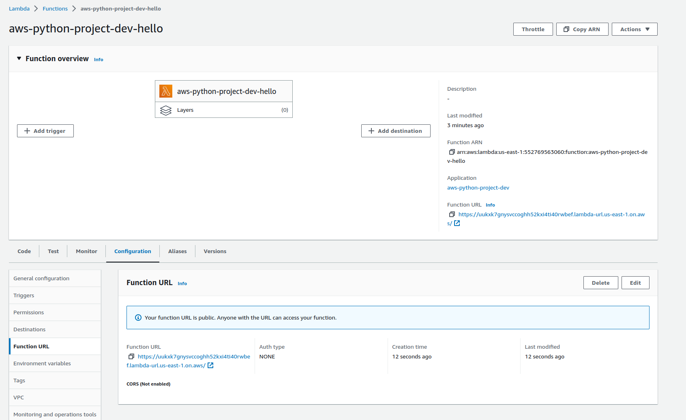

### 1. Tworzenie klastra
Jeśli chcemy zrobić to lokalnie mamy do wyboru:
* docker desktop
* rancher desktop
* minikube
* microk8s
* KIND (k8s in docker)

Zdecydowałem się na minikube. Instalujemy.

```
> curl -LO https://storage.googleapis.com/minikube/releases/latest/minikube-linux-amd64
  % Total    % Received % Xferd  Average Speed   Time    Time     Time  Current
                                 Dload  Upload   Total   Spent    Left  Speed
100 77.3M  100 77.3M    0     0  8789k      0  0:00:09  0:00:09 --:--:-- 8950k

> sudo install minikube-linux-amd64 /usr/local/bin/minikube

> minikube start
😄  minikube v1.29.0 on Ubuntu 22.10
✨  Automatically selected the docker driver. Other choices: kvm2, qemu2, virtualbox, none, ssh
📌  Using Docker driver with root privileges
👍  Starting control plane node minikube in cluster minikube
🚜  Pulling base image ...
💾  Downloading Kubernetes v1.26.1 preload ...
    > preloaded-images-k8s-v18-v1...:  397.05 MiB / 397.05 MiB  100.00% 7.17 Mi
    > gcr.io/k8s-minikube/kicbase...:  407.19 MiB / 407.19 MiB  100.00% 3.48 Mi
🔥  Creating docker container (CPUs=2, Memory=16000MB) ...
🐳  Preparing Kubernetes v1.26.1 on Docker 20.10.23 ...
    ▪ Generating certificates and keys ...
    ▪ Booting up control plane ...
    ▪ Configuring RBAC rules ...
🔗  Configuring bridge CNI (Container Networking Interface) ...
    ▪ Using image gcr.io/k8s-minikube/storage-provisioner:v5
🔎  Verifying Kubernetes components...
🌟  Enabled addons: default-storageclass, storage-provisioner
🏄  Done! kubectl is now configured to use "minikube" cluster and "default" namespace by default

> kubectl get pod -A
NAMESPACE     NAME                               READY   STATUS    RESTARTS      AGE
kube-system   coredns-787d4945fb-7p7xs           1/1     Running   0             85s
kube-system   etcd-minikube                      1/1     Running   0             99s
kube-system   kube-apiserver-minikube            1/1     Running   0             100s
kube-system   kube-controller-manager-minikube   1/1     Running   0             100s
kube-system   kube-proxy-pvdhb                   1/1     Running   0             86s
kube-system   kube-scheduler-minikube            1/1     Running   0             98s
kube-system   storage-provisioner                1/1     Running   1 (55s ago)   97s
```

Coś tam działa. :) Dodajmy sobie kilka node'ów.

```
> minikube node add
😄  Adding node m04 to cluster minikube
👍  Starting worker node minikube-m04 in cluster minikube
🚜  Pulling base image ...
🔥  Creating docker container (CPUs=2, Memory=2200MB) ...
🐳  Preparing Kubernetes v1.26.1 on Docker 20.10.23 ...
🔎  Verifying Kubernetes components...
🏄  Successfully added m04 to minikube!

> kubectl get node
NAME           STATUS   ROLES           AGE   VERSION
minikube       Ready    control-plane   20h   v1.26.1
minikube-m02   Ready    <none>          80s   v1.26.1
minikube-m03   Ready    <none>          51s   v1.26.1
minikube-m04   Ready    <none>          14s   v1.26.1
```

Tworzymy deployment i ustawiamy sobie watcha na podach.
```
> kubectl apply -f https://k8s.io/examples/application/deployment.yaml
deployment.apps/nginx-deployment created

> kubectl get pod -w
NAME                                READY   STATUS              RESTARTS   AGE
nginx-deployment-85996f8dbd-kj256   0/1     ContainerCreating   0          2s
nginx-deployment-85996f8dbd-schz8   1/1     Running             0          2s
nginx-deployment-85996f8dbd-kj256   1/1     Running             0          13s
```

Wyświetlamy informacje o deploymencie.

```
> kubectl get deploy
NAME               READY   UP-TO-DATE   AVAILABLE   AGE
nginx-deployment   2/2     2            2           82s

> kubectl describe deployment nginx-deployment
Name:                   nginx-deployment
Namespace:              default
CreationTimestamp:      Thu, 02 Feb 2023 15:19:30 +0100
Labels:                 <none>
Annotations:            deployment.kubernetes.io/revision: 1
Selector:               app=nginx
Replicas:               2 desired | 2 updated | 2 total | 2 available | 0 unavailable
StrategyType:           RollingUpdate
MinReadySeconds:        0
RollingUpdateStrategy:  25% max unavailable, 25% max surge
Pod Template:
  Labels:  app=nginx
  Containers:
   nginx:
    Image:        nginx:1.14.2
    Port:         80/TCP
    Host Port:    0/TCP
    Environment:  <none>
    Mounts:       <none>
  Volumes:        <none>
Conditions:
  Type           Status  Reason
  ----           ------  ------
  Available      True    MinimumReplicasAvailable
  Progressing    True    NewReplicaSetAvailable
OldReplicaSets:  <none>
NewReplicaSet:   nginx-deployment-85996f8dbd (2/2 replicas created)
Events:
  Type    Reason             Age   From                   Message
  ----    ------             ----  ----                   -------
  Normal  ScalingReplicaSet  98s   deployment-controller  Scaled up replica set nginx-deployment-85996f8dbd to 2
```

Wyświetlamy szczegóły jednego z utworzonych podów.

```
> kubectl get pod -l app=nginx
NAME                                READY   STATUS    RESTARTS   AGE
nginx-deployment-85996f8dbd-kj256   1/1     Running   0          12m
nginx-deployment-85996f8dbd-schz8   1/1     Running   0          12m

> kubectl describe pod nginx-deployment-85996f8dbd-kj256
Name:             nginx-deployment-85996f8dbd-kj256
Namespace:        default
Priority:         0
Service Account:  default
Node:             minikube-m02/192.168.49.3
Start Time:       Thu, 02 Feb 2023 15:19:30 +0100
Labels:           app=nginx
                  pod-template-hash=85996f8dbd
Annotations:      <none>
Status:           Running
IP:               10.244.1.2
IPs:
  IP:           10.244.1.2
Controlled By:  ReplicaSet/nginx-deployment-85996f8dbd
Containers:
  nginx:
    Container ID:   docker://c7fc39544e6cb405a4af80c59cbd88ddcbb326faa51b7b76dbcb8d58e047674c
    Image:          nginx:1.14.2
    Image ID:       docker-pullable://nginx@sha256:f7988fb6c02e0ce69257d9bd9cf37ae20a60f1df7563c3a2a6abe24160306b8d
    Port:           80/TCP
    Host Port:      0/TCP
    State:          Running
      Started:      Thu, 02 Feb 2023 15:19:43 +0100
    Ready:          True
    Restart Count:  0
    Environment:    <none>
    Mounts:
      /var/run/secrets/kubernetes.io/serviceaccount from kube-api-access-2dpz9 (ro)
Conditions:
  Type              Status
  Initialized       True 
  Ready             True 
  ContainersReady   True 
  PodScheduled      True 
Volumes:
  kube-api-access-2dpz9:
    Type:                    Projected (a volume that contains injected data from multiple sources)
    TokenExpirationSeconds:  3607
    ConfigMapName:           kube-root-ca.crt
    ConfigMapOptional:       <nil>
    DownwardAPI:             true
QoS Class:                   BestEffort
Node-Selectors:              <none>
Tolerations:                 node.kubernetes.io/not-ready:NoExecute op=Exists for 300s
                             node.kubernetes.io/unreachable:NoExecute op=Exists for 300s
Events:
  Type    Reason     Age   From               Message
  ----    ------     ----  ----               -------
  Normal  Scheduled  15m   default-scheduler  Successfully assigned default/nginx-deployment-85996f8dbd-kj256 to minikube-m02
  Normal  Pulling    15m   kubelet            Pulling image "nginx:1.14.2"
  Normal  Pulled     15m   kubelet            Successfully pulled image "nginx:1.14.2" in 11.952023062s (11.952030727s including waiting)
  Normal  Created    15m   kubelet            Created container nginx
  Normal  Started    15m   kubelet            Started container nginx
```

Z ciekawości sprawdźmy na których node'ach są nasze pody.

```
> kubectl get pod -o wide
NAME                                READY   STATUS    RESTARTS   AGE   IP           NODE           NOMINATED NODE   READINESS GATES
nginx-deployment-85996f8dbd-kj256   1/1     Running   0          17m   10.244.1.2   minikube-m02   <none>           <none>
nginx-deployment-85996f8dbd-schz8   1/1     Running   0          17m   10.244.2.3   minikube-m03   <none>           <none>
```

Spawnujemy sobie drugi terminal w których ustawiamy watcha na pody. W pierwszym robi aktualizację deploymentu.

```
t1 > kubectl apply -f https://k8s.io/examples/application/deployment-update.yamldeployment.apps/nginx-deployment configured

t2 > kubectl get pod -w 
NAME                                READY   STATUS    RESTARTS   AGE
nginx-deployment-85996f8dbd-kj256   1/1     Running   0          19m
nginx-deployment-85996f8dbd-schz8   1/1     Running   0          19m
nginx-deployment-66f8758855-htwnc   0/1     Pending   0          0s
nginx-deployment-66f8758855-htwnc   0/1     Pending   0          0s
nginx-deployment-66f8758855-htwnc   0/1     ContainerCreating   0          0s
nginx-deployment-66f8758855-htwnc   1/1     Running             0          15s
nginx-deployment-85996f8dbd-schz8   1/1     Terminating         0          19m
nginx-deployment-66f8758855-dwpdq   0/1     Pending             0          0s
nginx-deployment-66f8758855-dwpdq   0/1     Pending             0          0s
nginx-deployment-66f8758855-dwpdq   0/1     ContainerCreating   0          0s
nginx-deployment-85996f8dbd-schz8   0/1     Terminating         0          19m
nginx-deployment-85996f8dbd-schz8   0/1     Terminating         0          19m
nginx-deployment-85996f8dbd-schz8   0/1     Terminating         0          19m
nginx-deployment-66f8758855-dwpdq   1/1     Running             0          15s
nginx-deployment-85996f8dbd-kj256   1/1     Terminating         0          20m
nginx-deployment-85996f8dbd-kj256   0/1     Terminating         0          20m
nginx-deployment-85996f8dbd-kj256   0/1     Terminating         0          20m
nginx-deployment-85996f8dbd-kj256   0/1     Terminating         0          20m
```

Z grubsza widać flow, który przedstawia się następująco:
* tworzony i uruchamiany jest nowy pod
* ubijany jest stary

  
Edytujemy deployment i sprawdzamy ilość podów.
```
> kubectl edit deployment nginx-deployment
deployment.apps/nginx-deployment edited

> kubectl get pod
NAME                                READY   STATUS              RESTARTS   AGE
nginx-deployment-66f8758855-4kjp4   0/1     ContainerCreating   0          4s
nginx-deployment-66f8758855-dwpdq   1/1     Running             0          7h33m
nginx-deployment-66f8758855-htwnc   1/1     Running             0          7h33m
nginx-deployment-66f8758855-qwt89   0/1     ContainerCreating   0          4s
```

Robimy przekierowanie portu 80 na naszego poda.
```
> kubectl port-forward nginx-deployment-66f8758855-dwpdq 80:80 --address=0.0.0.0
Unable to listen on port 80: Listeners failed to create with the following errors: [unable to create listener: Error listen tcp4 0.0.0.0:80: bind: permission denied]
error: unable to listen on any of the requested ports: [{80 80}]
```

Pierwsze 1024 portów nie jest dostępne dla szarego użytkownika, możemy zatem albo pokusić się o uruchomienie jako root, albo wykorzystać inny port.

```
> kubectl port-forward nginx-deployment-66f8758855-dwpdq 32180:80 --address=0.0.0.0
Forwarding from 0.0.0.0:32180 -> 80
```

Sprawdzamy

```
> curl localhost:32180
<!DOCTYPE html>
<html>
<head>
<title>Welcome to nginx!</title>
<style>
    body {
        width: 35em;
        margin: 0 auto;
        font-family: Tahoma, Verdana, Arial, sans-serif;
    }
</style>
</head>
<body>
<h1>Welcome to nginx!</h1>
<p>If you see this page, the nginx web server is successfully installed and
working. Further configuration is required.</p>

<p>For online documentation and support please refer to
<a href="http://nginx.org/">nginx.org</a>.<br/>
Commercial support is available at
<a href="http://nginx.com/">nginx.com</a>.</p>

<p><em>Thank you for using nginx.</em></p>
</body>
</html>
```

Usuwamy wdrożenie.

```
> kubectl delete deployment nginx-deployment
deployment.apps "nginx-deployment" deleted

> kubectl get pod
No resources found in default namespace.
```

#### Pytania

> Porównaj k8s do dockera

Docker jest platformą do tworzenia i uruchamiania kontenerów.  
Kubernetes z kolei jest platformą do zarządzania aplikacjami w środowisku kontenerowym, jest systemem do automatyzacji rozmieszczania, skalowania i zarządzania cyklem życia aplikacji kontenerowych.


### 2. Helm i helm chart

```
> helm create nginx-chart
Creating nginx-chart

> rm -r nginx-chart/templates/
> rm -r nginx-chart/charts/

> ls -R nginx-chart/
nginx-chart/:
Chart.yaml  values.yaml
```

Dodajemy templatki
```
> ls -R .
.:
Chart.yaml  templates  values.yaml

./templates:
configmap.yaml  deployment.yaml  service.yaml
```

Odpalamy linter
```
> helm lint .
==> Linting .
[INFO] Chart.yaml: icon is recommended
[ERROR] templates/deployment.yaml: unable to parse YAML: error converting YAML to JSON: yaml: invalid map key: map[interface {}]interface {}{".Values.replicaCount":interface {}(nil)}
```

Wygląda na to, że wartości powinny być owrapowane w ciapki `"`.

```
> helm lint .
==> Linting .
[INFO] Chart.yaml: icon is recommended

1 chart(s) linted, 0 chart(s) failed
```

Sprawdźmy tylko czy teraz nie zostaną podstawione stringi zamiast naszych wartości.

```
> helm template . | grep replicas
  replicas: "4"
```

No to zainstalujmy.

```
> helm install nginx nginx-chart
Error: INSTALLATION FAILED: Kubernetes cluster unreachable: Get "https://192.168.49.2:8443/version": dial tcp 192.168.49.2:8443: connect: no route to host
```

albo i nie. Oczywiście w tym wypadku zapomniałem o odpaleniu minikube.

```
> minikube start
(...)

> helm install nginx nginx-chart
Error: INSTALLATION FAILED: Deployment in version "v1" cannot be handled as a Deployment: json: cannot unmarshal string into Go struct field DeploymentSpec.spec.replicas of type int32
```

Zabawna sytuacja, wygląda na to, że helmowy linter nam nie puszcza czegoś typu
`{{ .Values.replicaCount }}`, a tutaj mamy problem z parsowaniem `"4"` jako int.

Szukając rozwiązania podbiłem jeszcze wersję helma licząc, że może coś się zmieniło przy parsowaniu, problemem okazał się autoformat (eslint) w vscode, który zamieniał pary nawiasów `{{ }}` na `{ { } }` celem poprawy widoczności... :)

```diff
templates/deployment.yaml

spec:
-  replicas: { { .Values.replicaCount } }
+ replicas: {{ .Values.replicaCount }}
```

Powtarzamy cały proces
```
> helm lint nginx-chart/
==> Linting nginx-chart/
[INFO] Chart.yaml: icon is recommended

1 chart(s) linted, 0 chart(s) failed
> helm template nginx-chart/ | grep replica
  replicas: 4
```
Wygląda sensowniej, instalujemy.

```
> helm install nginx nginx-chart
NAME: nginx
LAST DEPLOYED: Sun Feb 12 13:04:32 2023
NAMESPACE: default
STATUS: deployed
REVISION: 1
TEST SUITE: None
```
Yay.

```
> helm list
NAME    NAMESPACE       REVISION        UPDATED                                 STATUS          CHART                   APP VERSION
nginx   default         1               2023-02-12 13:04:32.082687828 +0100 CET deployed        nginx-chart-0.1.0       1.0.0      

> kubectl get deploy
NAME               READY   UP-TO-DATE   AVAILABLE   AGE
nginx-deployment   4/4     4            4           39s

> kubectl get configmap
NAME                         DATA   AGE
kube-root-ca.crt             1      10d
nginx-index-html-configmap   1      49s

> kubectl get services
NAME            TYPE        CLUSTER-IP     EXTERNAL-IP   PORT(S)   AGE
kubernetes      ClusterIP   10.96.0.1      <none>        443/TCP   10d
nginx-service   ClusterIP   10.101.13.46   <none>        80/TCP    55s

> kubectl get pods
NAME                                READY   STATUS    RESTARTS   AGE
nginx-deployment-566b74bc9d-gksgc   1/1     Running   0          59s
nginx-deployment-566b74bc9d-j45xp   1/1     Running   0          59s
nginx-deployment-566b74bc9d-q9xch   1/1     Running   0          59s
nginx-deployment-566b74bc9d-zsw5m   1/1     Running   0          59s
```

Robimy upgrade z nowymi wartościami.
```
> helm upgrade nginx nginx-chart --values envs/prod.yaml 
Release "nginx" has been upgraded. Happy Helming!
NAME: nginx
LAST DEPLOYED: Sun Feb 12 13:07:08 2023
NAMESPACE: default
STATUS: deployed
REVISION: 2
TEST SUITE: None

> helm list
NAME    NAMESPACE       REVISION        UPDATED                                 STATUS          CHART                   APP VERSION
nginx   default         2               2023-02-12 13:07:08.024316306 +0100 CET deployed        nginx-chart-0.1.0       1.0.0   

> kubectl get pods
NAME                                READY   STATUS    RESTARTS   AGE
nginx-deployment-566b74bc9d-792t2   1/1     Running   0          18s
nginx-deployment-566b74bc9d-cvgx9   1/1     Running   0          18s
nginx-deployment-566b74bc9d-dggxk   1/1     Running   0          18s
nginx-deployment-566b74bc9d-fkh5f   1/1     Running   0          18s
nginx-deployment-566b74bc9d-ggzjv   1/1     Running   0          18s
nginx-deployment-566b74bc9d-gksgc   1/1     Running   0          2m54s
nginx-deployment-566b74bc9d-j45xp   1/1     Running   0          2m54s
nginx-deployment-566b74bc9d-q9xch   1/1     Running   0          2m54s
nginx-deployment-566b74bc9d-vd8kd   1/1     Running   0          18s
nginx-deployment-566b74bc9d-zsw5m   1/1     Running   0          2m54s
```

Rollbackujemy
```
> helm rollback nginx
Rollback was a success! Happy Helming!

> helm list
NAME    NAMESPACE       REVISION        UPDATED                                 STATUS          CHART                   APP VERSION
nginx   default         3               2023-02-12 13:08:43.1151364 +0100 CET   deployed        nginx-chart-0.1.0       1.0.0      

> kubectl get pod
NAME                                READY   STATUS    RESTARTS   AGE
nginx-deployment-566b74bc9d-gksgc   1/1     Running   0          4m24s
nginx-deployment-566b74bc9d-j45xp   1/1     Running   0          4m24s
nginx-deployment-566b74bc9d-q9xch   1/1     Running   0          4m24s
nginx-deployment-566b74bc9d-zsw5m   1/1     Running   0          4m24s
```

Usuwamy wdrożenie
```
> helm uninstall nginx
release "nginx" uninstalled

> kubectl get pods
No resources found in default namespace.
```

#### Pytania

> Czym jest Helm dla Kubernetes?

Helm jest narzędziem, które pomaga w automatyzacji i ujednolicaniu procesu instalowania, aktualizowania i usuwania aplikacji w k8s.

### 3. Analiza bezpieczeństwa

```
> terrascan version
version: v1.17.1
```

```
> terrascan scan --help
(...)
-i, --iac-type string           iac type (arm, cft, docker, helm, k8s, kustomize, terraform, tfplan)
```

```
> terrascan scan -i terraform .
(...)
Scan Summary -
	File/Folder         :	(...)/iac-labs/terraform
	IaC Type            :	terraform
	Scanned At          :	2023-02-12 12:23:21.883498863 +0000 UTC
	Policies Validated  :	12
	Violated Policies   :	19
	Low                 :	3
	Medium              :	11
	High                :	5
```

```
> terrascan scan -i docker .
Scan Summary -
	File/Folder         :	(...)/iac-labs/example-app
	IaC Type            :	docker
	Scanned At          :	2023-02-12 12:25:39.041717707 +0000 UTC
	Policies Validated  :	22
	Violated Policies   :	0
	Low                 :	0
	Medium              :	0
	High                :	0
```

```
> terrascan scan -i cft
(...)
Scan Summary -
	File/Folder         :	(...)/iac-labs/infra/lab2/zad4
	IaC Type            :	cft
	Scanned At          :	2023-02-12 12:27:16.453758684 +0000 UTC
	Policies Validated  :	142
	Violated Policies   :	2
	Low                 :	0
	Medium              :	1
	High                :	1
```

```
> terrascan scan -i k8s -r git -u https://github.com/kubernetes/examples.git
Scan Summary -
	File/Folder         :	https://github.com/kubernetes/examples.git
	IaC Type            :	k8s
	Scanned At          :	2023-02-12 12:29:02.928676771 +0000 UTC
	Policies Validated  :	42
	Violated Policies   :	1689
	Low                 :	318
	Medium              :	1099
	High                :	272
```

#### Pytania
> Co analizuje terrascan?

Przy pomocy terrascan możemy zeskanować hcl (terraform), cft (aws cloudformation), arm (azure resource manager), kubernetes, helm, kustomize i dockerfile. 
Terrascan sprawdza czy w/w spełniają odpowiednie standardy bezpieczeństwa i konfiguracji, może to obejmować
takie rzeczy jak ustawienie firewalla, kontrola dostępu, poprawność składni czy ustawienia zasobów.

> Czy to narzędzie gwarantuje bezpieczeństwo wdrożeń?

Terrascan stanowi poważne wsparcie w procesie zapewniania bezpieczeństwa wdrożeń, ale nie gwarantuje samodzielnie bezpieczeństwa. Bezpieczeństwo wdrożeń zależy też od wielu innych czynników jak konfiguracja systemu.

> Poszukaj alternatywnych programów i zaproponuj

* tfsec
* bridgecrew
* hashicorp sentinel

### 4. Bezserwerowe Hello World

```
> serverless

Creating a new serverless project

? What do you want to make? AWS - Python - Starter
? What do you want to call this project? aws-python-project

✔ Project successfully created in aws-python-project folder

? Do you want to login/register to Serverless Dashboard? No

? Do you want to deploy now? Yes

Deploying aws-python-project to stage dev (us-east-1)

✔ Service deployed to stack aws-python-project-dev (97s)

functions:
  hello: aws-python-project-dev-hello (1.7 kB)

What next?
Run these commands in the project directory:

serverless deploy    Deploy changes
serverless info      View deployed endpoints and resources
serverless invoke    Invoke deployed functions
serverless --help    Discover more commands
```

```json
> serverless invoke --function hello
{
    "statusCode": 200,
    "body": "{\"message\": \"Go Serverless v3.0! Your function executed successfully!\", \"input\": {}}"
}
```



```json
> curl https://uukxk7gnysvccoghh52kxi4ti40rwbef.lambda-url.us-east-1.on.aws/ | json_pp

{
   "input" : {
      "headers" : {
         "accept" : "*/*",
         "accept-encoding" : "gzip,deflate",
         "content-length" : "0",
         "host" : "uukxk7gnysvccoghh52kxi4ti40rwbef.cell-1-lambda-url.us-east-1.on.aws",
         "user-agent" : "curl/7.85.0",
         "x-amzn-lambda-forwarded-client-ip" : "1.2.4.5",
         "x-amzn-lambda-forwarded-host" : "uukxk7gnysvccoghh52kxi4ti40rwbef.lambda-url.us-east-1.on.aws",
         "x-amzn-lambda-proxy-auth" : "HmacSHA256, SignedHeaders=x-amzn-lambda-forwarded-client-ip;x-amzn-lambda-forwarded-host;x-amzn-lambda-proxying-cell, Signature=42q3lRJVxdJfP1EzlimqbGbThTtW6kvV2lbJvT+biRw=",
         "x-amzn-lambda-proxying-cell" : "0",
         "x-amzn-tls-cipher-suite" : "ECDHE-RSA-AES128-GCM-SHA256",
         "x-amzn-tls-version" : "TLSv1.2",
         "x-amzn-trace-id" : "Self=1-63e8e375-5b39dc8a1e1b362c06698dc9;Root=1-63e8e375-61e4585034bb191e63a8b33f",
         "x-forwarded-for" : "1.2.4.5",
         "x-forwarded-port" : "443",
         "x-forwarded-proto" : "https"
      },
      "isBase64Encoded" : false,
      "rawPath" : "/",
      "rawQueryString" : "",
      "requestContext" : {
         "accountId" : "anonymous",
         "apiId" : "uukxk7gnysvccoghh52kxi4ti40rwbef",
         "domainName" : "uukxk7gnysvccoghh52kxi4ti40rwbef.cell-1-lambda-url.us-east-1.on.aws",
         "domainPrefix" : "uukxk7gnysvccoghh52kxi4ti40rwbef",
         "http" : {
            "method" : "GET",
            "path" : "/",
            "protocol" : "HTTP/1.1",
            "sourceIp" : "1.2.4.5",
            "userAgent" : "curl/7.85.0"
         },
         "requestId" : "9b2653e2-75fc-46d4-a53f-15bcb53a4b84",
         "routeKey" : "$default",
         "stage" : "$default",
         "time" : "12/Feb/2023:13:02:45 +0000",
         "timeEpoch" : 1676206965574
      },
      "routeKey" : "$default",
      "version" : "2.0"
   },
   "message" : "Go Serverless v3.0! Your function executed successfully!"
}
```

```
> serverless remove
Removing aws-python-project from stage dev (us-east-1)

✔ Service aws-python-project has been successfully removed (20s)
```

#### Pytania

> Podaj przykładowe zastosowania dla bezserwerowych funkcji

* event-driven data processing,
* backend dla web aplikacji,
* iot - zbieranie danych,

> Co jest główną zaletą dla programistów w tym podejściu?

* brak konieczności zarządzania serwerami,
* skalowalność,
* łatwiejsze wdrażanie i testowanie