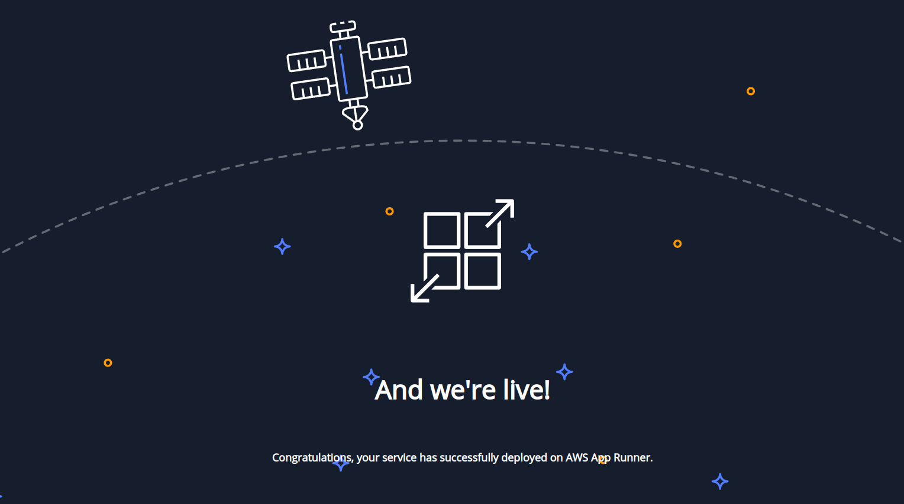

### Zadanie 1: Terraform składnia, idempotentność, modularność

Exportujemy zmienne **AWS_ACCESS_KEY_ID** i **AWS_SECRET_ACCESS_KEY** korzystając z klucza wygenerowanego we wcześniejszym laboratorium.  
Dla ułatwienia tworzymy alias. `alias tf=terraform`

```
> tf --version
Terraform v1.3.7 on linux_amd64
```

#### 1-import

```
> pwd
.../iac-labs/terraform/zad1/1-import

> tf init
Initializing the backend...
Initializing provider plugins...
- Finding hashicorp/aws versions matching "4.49.0"...
- Installing hashicorp/aws v4.49.0...
- Installed hashicorp/aws v4.49.0 (signed by HashiCorp)

Terraform has been successfully initialized!

> tf plan
...
# aws_instance.web will be created
+ ami           = "ami-0a261c0e5f51090b1"
+ instance_type = "t2.micro"
...
Plan: 1 to add, 0 to change, 0 to destroy.


> tf apply -auto-approve
...
Plan: 1 to add, 0 to change, 0 to destroy.
aws_instance.web: Creating...
aws_instance.web: Still creating... [10s elapsed]
aws_instance.web: Still creating... [20s elapsed]
aws_instance.web: Still creating... [30s elapsed]
aws_instance.web: Creation complete after 32s [id=i-0526b9b98230b7856]

Apply complete! Resources: 1 added, 0 changed, 0 destroyed.
```

Sprawdzamy czy terraform nie kłamie :)
```
> aws ec2 describe-instances --query "Reservations[].Instances[].InstanceId"
[
    "i-0526b9b98230b7856"
]
```

```
> tf apply
aws_instance.web: Refreshing state... [id=i-0526b9b98230b7856]

No changes. Your infrastructure matches the configuration.

Terraform has compared your real infrastructure against your configuration and found no differences, so no changes are needed.

Apply complete! Resources: 0 added, 0 changed, 0 destroyed.
```

```
> tf destroy -auto-approve
...
Plan: 0 to add, 0 to change, 1 to destroy.
aws_instance.web: Destroying... [id=i-0526b9b98230b7856]
aws_instance.web: Still destroying... [id=i-0526b9b98230b7856, 2m30s elapsed]
aws_instance.web: Destruction complete after 2m31s

Destroy complete! Resources: 1 destroyed.

> aws ec2 describe-instances --query "Reservations[].Instances[].[InstanceId, Monitoring.State, State.Name]" --output text
i-0526b9b98230b7856     disabled        terminated
```

#### 2-zmienne

```
> tf init
...
Terraform has been successfully initialized!

> tf apply
# aws_instance.web will be created
# aws_subnet.main will be created
# aws_vpc.main will be created

Plan: 3 to add, 0 to change, 0 to destroy.
aws_vpc.main: Creating...
aws_vpc.main: Creation complete after 2s [id=vpc-0ca2f231dccf980c3]
aws_subnet.main: Creating...
aws_subnet.main: Creation complete after 1s [id=subnet-0efa64976be11f4c0]
aws_instance.web: Creating...
aws_instance.web: Still creating... [30s elapsed]
aws_instance.web: Creation complete after 31s [id=i-0fd36c882e351e0ab]

Apply complete! Resources: 3 added, 0 changed, 0 destroyed.

> tf plan
aws_vpc.main: Refreshing state... [id=vpc-0ca2f231dccf980c3]
aws_subnet.main: Refreshing state... [id=subnet-0efa64976be11f4c0]
aws_instance.web: Refreshing state... [id=i-0fd36c882e351e0ab]

No changes. Your infrastructure matches the configuration.

Terraform has compared your real infrastructure against your configuration and found no differences, so no changes are needed.
```

Sprawdźmy
```
> aws ec2 describe-instances --query "Reservations[].Instances[].[InstanceId, Monitoring.State, State.Name]" --output text
i-0526b9b98230b7856     disabled        terminated
i-0fd36c882e351e0ab     disabled        running

> aws ec2 describe-instances --filters "Name=instance-id,Values=i-0fd36c882e351e0ab" --query "Reservations[].Instances[].[SubnetId, VpcId]"
[
    [
        "subnet-0efa64976be11f4c0",
        "vpc-0ca2f231dccf980c3"
    ]
]

> aws ec2 describe-vpcs --filters "Name=vpc-id,Values=vpc-0ca2f231dccf980c3"
{
    "Vpcs": [
        {
            "CidrBlock": "10.5.0.0/16",
            "DhcpOptionsId": "dopt-03bfeae53070d2126",
            "State": "available",
            "VpcId": "vpc-0ca2f231dccf980c3",
            "OwnerId": "552769563060",
            "InstanceTenancy": "default",
            "CidrBlockAssociationSet": [
                {
                    "AssociationId": "vpc-cidr-assoc-036eb9c8ea676e808",
                    "CidrBlock": "10.5.0.0/16",
                    "CidrBlockState": {
                        "State": "associated"
                    }
                }
            ],
            "IsDefault": false,
            "Tags": [
                {
                    "Key": "baz",
                    "Value": "123"
                },
                {
                    "Key": "Name",
                    "Value": "some-vpc"
                },
                {
                    "Key": "foo",
                    "Value": "bar"
                }
            ]
        }
    ]
}

> aws ec2 describe-subnets --filters "Name=subnet-id,Values=subnet-0efa64976be11f4c0"
{
    "Subnets": [
        {
            "AvailabilityZone": "eu-central-1a",
            "AvailabilityZoneId": "euc1-az2",
            "AvailableIpAddressCount": 122,
            "CidrBlock": "10.5.0.0/25",
            "DefaultForAz": false,
            "MapPublicIpOnLaunch": false,
            "MapCustomerOwnedIpOnLaunch": false,
            "State": "available",
            "SubnetId": "subnet-0efa64976be11f4c0",
            "VpcId": "vpc-0ca2f231dccf980c3",
            "OwnerId": "552769563060",
            "AssignIpv6AddressOnCreation": false,
            "Ipv6CidrBlockAssociationSet": [],
            "Tags": [
                {
                    "Key": "Name",
                    "Value": "tuts-subnet"
                }
            ],
            "SubnetArn": "arn:aws:ec2:eu-central-1:552769563060:subnet/subnet-0efa64976be11f4c0",
            "EnableDns64": false,
            "Ipv6Native": false,
            "PrivateDnsNameOptionsOnLaunch": {
                "HostnameType": "ip-name",
                "EnableResourceNameDnsARecord": false,
                "EnableResourceNameDnsAAAARecord": false
            }
        }
    ]
}

```
I usuwamy

```
> tf destroy
...
Plan: 0 to add, 0 to change, 3 to destroy.

aws_instance.web: Destroying... [id=i-0fd36c882e351e0ab]
aws_instance.web: Still destroying... [id=i-0fd36c882e351e0ab, 40s elapsed]
aws_instance.web: Destruction complete after 40s
aws_subnet.main: Destroying... [id=subnet-0efa64976be11f4c0]
aws_subnet.main: Destruction complete after 0s
aws_vpc.main: Destroying... [id=vpc-0ca2f231dccf980c3]
aws_vpc.main: Destruction complete after 1s

Destroy complete! Resources: 3 destroyed.
```

#### 3-moduly

```
> tf init
Initializing modules...
- aws_vpc in modules/vpc
- aws_vpc_east in modules/vpc
- webserver in modules/ec2
- webserver2 in modules/ec2
...

╷
│ Warning: Reference to undefined provider
│ 
│   on main.tf line 29, in module "aws_vpc_east":
│   29:     aws = aws.east
│ 
│ There is no explicit declaration for local provider name "aws" in module.aws_vpc_east, so Terraform is assuming you mean to pass a configuration for "hashicorp/aws".
│ 
│ If you also control the child module, add a required_providers entry named "aws" with the source address "hashicorp/aws".

Terraform has been successfully initialized!
```

Aby warning nie psuł nam wzroku możemy pokusić się o dodanie sekcji `required_providers` w module `vpc`.  
  
Nie zmieniamy AMI żeby zobaczyć czy wybuchnie. :)

```
> tf apply
Plan: 6 to add, 0 to change, 0 to destroy.

Changes to Outputs:
  + webserver = (known after apply)

module.aws_vpc.aws_vpc.main: Creating...
module.aws_vpc_east.aws_vpc.main: Creating...
module.aws_vpc.aws_vpc.main: Creation complete after 2s [id=vpc-068c2b6050fa26230]
module.webserver.aws_subnet.webserver: Creating...
module.webserver.aws_subnet.webserver: Creation complete after 1s [id=subnet-0dc6631b276c2b3a0]
module.webserver.aws_instance.webserver: Creating...
module.aws_vpc_east.aws_vpc.main: Creation complete after 2s [id=vpc-033b4c21cbd2df3cb]
module.webserver2.aws_subnet.webserver: Creating...
module.webserver2.aws_subnet.webserver: Creation complete after 1s [id=subnet-081bbf154d466f00d]
module.webserver2.aws_instance.webserver: Creating...
module.webserver.aws_instance.webserver: Still creating... [40s elapsed]
module.webserver.aws_instance.webserver: Creation complete after 42s [id=i-07656875ded8ffa01]

╷
│ Error: creating EC2 Instance: InvalidAMIID.NotFound: The image id '[ami-0a261c0e5f51090b1]' does not exist
│       status code: 400, request id: 38e06335-e990-47a9-af66-c714fe06b4af
│ 
│   with module.webserver2.aws_instance.webserver,
│   on modules/ec2/main.tf line 19, in resource "aws_instance" "webserver":
│   19: resource "aws_instance" "webserver" {
│ 
```
No i wybuchło... :) 

```
> aws ec2 describe-images --filters "Name=image-id,Values=ami-0a261c0e5f51090b1"
{
    "Images": [
        {
            "Architecture": "x86_64",
            "CreationDate": "2022-12-16T02:08:45.000Z",
            "ImageId": "ami-0a261c0e5f51090b1",
            "ImageLocation": "amazon/amzn2-ami-kernel-5.10-hvm-2.0.20221210.1-x86_64-gp2",
            "ImageType": "machine",
            "Public": true,
            "OwnerId": "137112412989",
            "PlatformDetails": "Linux/UNIX",
            "UsageOperation": "RunInstances",
            "State": "available",
            "BlockDeviceMappings": [
                {
                    "DeviceName": "/dev/xvda",
                    "Ebs": {
                        "DeleteOnTermination": true,
                        "SnapshotId": "snap-0bd9ae945a913245e",
                        "VolumeSize": 8,
                        "VolumeType": "gp2",
                        "Encrypted": false
                    }
                }
            ],
            "Description": "Amazon Linux 2 Kernel 5.10 AMI 2.0.20221210.1 x86_64 HVM gp2",
            "EnaSupport": true,
            "Hypervisor": "xen",
            "ImageOwnerAlias": "amazon",
            "Name": "amzn2-ami-kernel-5.10-hvm-2.0.20221210.1-x86_64-gp2",
            "RootDeviceName": "/dev/xvda",
            "RootDeviceType": "ebs",
            "SriovNetSupport": "simple",
            "VirtualizationType": "hvm",
            "DeprecationTime": "2024-12-16T02:08:45.000Z"
        }
    ]
}
```

Nie ma informacji w jakim regionie możemy posługiwać się tym obrazem - bida z nyndzo.  
Spróbujmy z drugiej strony.  

      --region (string)
       The region to use. Overrides config/env settings.
  
```
> aws ec2 describe-images --owners amazon --region "us-east-1"
```

i wybieramy z listy `ami-0d8c09355d5cab0a2` licząc, że wybuchnie z jakiegoś powodu :)  
Zmieniamy `main.tf` i próbujemy jeszcze raz.

```
> tf apply
Plan: 1 to add, 0 to change, 0 to destroy.

module.webserver2.aws_instance.webserver: Creating...
module.webserver2.aws_instance.webserver: Still creating... [10s elapsed]
module.webserver2.aws_instance.webserver: Still creating... [20s elapsed]
module.webserver2.aws_instance.webserver: Still creating... [30s elapsed]
module.webserver2.aws_instance.webserver: Creation complete after 34s [id=i-0863d01f57762d561]

Apply complete! Resources: 1 added, 0 changed, 0 destroyed.

Outputs:

webserver = ""
```

Wygląda, że wszystko działa, weryfikacja instancji ec2.

```
> aws ec2 describe-instances --filters "Name=instance-state-name,Values=running" --output table

----------------------------------------------------------------------------------
|                                DescribeInstances                               |
+--------------------------------------------------------------------------------+
||                                 Reservations                                 ||
|+--------------------------------+---------------------------------------------+|
||  OwnerId                       |  552769563060                               ||
||  ReservationId                 |  r-092409629fd0d1e69                        ||
|+--------------------------------+---------------------------------------------+|
|||                                  Instances                                 |||
||+---------------------------+------------------------------------------------+||
|||  AmiLaunchIndex           |  0                                             |||
|||  Architecture             |  x86_64                                        |||
|||  ClientToken              |  terraform-20230119230650647500000001          |||
|||  EbsOptimized             |  False                                         |||
|||  EnaSupport               |  True                                          |||
|||  Hypervisor               |  xen                                           |||
|||  ImageId                  |  ami-0a261c0e5f51090b1                         |||
|||  InstanceId               |  i-07656875ded8ffa01                           |||
|||  InstanceType             |  t2.micro                                      |||
|||  LaunchTime               |  2023-01-19T23:06:51+00:00                     |||
|||  PlatformDetails          |  Linux/UNIX                                    |||
|||  PrivateDnsName           |  ip-10-0-20-179.eu-central-1.compute.internal  |||
|||  PrivateIpAddress         |  10.0.20.179                                   |||
|||  PublicDnsName            |                                                |||
|||  RootDeviceName           |  /dev/xvda                                     |||
|||  RootDeviceType           |  ebs                                           |||
|||  SourceDestCheck          |  True                                          |||
|||  StateTransitionReason    |                                                |||
|||  SubnetId                 |  subnet-0dc6631b276c2b3a0                      |||
|||  UsageOperation           |  RunInstances                                  |||
|||  UsageOperationUpdateTime |  2023-01-19T23:06:51+00:00                     |||
|||  VirtualizationType       |  hvm                                           |||
|||  VpcId                    |  vpc-068c2b6050fa26230                         |||
||+---------------------------+------------------------------------------------+||
```

Zauważamy dwie rzeczy:
* aws-cli potrafi rysować śliczne tabelki :)
* nie ma naszej drugiej instancji, prawdopodobnie ze względu na domyślny region

```
> aws ec2 describe-instances --filters "Name=instance-state-name,Values=running" --query "Reservations[].Instances[].InstanceId"
[
    "i-07656875ded8ffa01"
]

> aws ec2 describe-instances --filters "Name=instance-state-name,Values=running" --query "Reservations[].Instances[].InstanceId" --region us-east-1
[
    "i-0863d01f57762d561"
]
```

Pamiętamy o usunięciu wszystkiego.

```
> tf destroy
Plan: 0 to add, 0 to change, 6 to destroy.

Changes to Outputs:
module.webserver.aws_instance.webserver: Destroying... [id=i-07656875ded8ffa01]
module.webserver2.aws_instance.webserver: Destroying... [id=i-0863d01f57762d561]
module.webserver.aws_instance.webserver: Still destroying... [id=i-07656875ded8ffa01, 10s elapsed]
module.webserver2.aws_instance.webserver: Still destroying... [id=i-0863d01f57762d561, 10s elapsed]
module.webserver.aws_instance.webserver: Still destroying... [id=i-07656875ded8ffa01, 20s elapsed]
module.webserver2.aws_instance.webserver: Still destroying... [id=i-0863d01f57762d561, 20s elapsed]
module.webserver.aws_instance.webserver: Destruction complete after 30s
module.webserver.aws_subnet.webserver: Destroying... [id=subnet-0dc6631b276c2b3a0]
module.webserver2.aws_instance.webserver: Still destroying... [id=i-0863d01f57762d561, 30s elapsed]
module.webserver.aws_subnet.webserver: Destruction complete after 1s
module.aws_vpc.aws_vpc.main: Destroying... [id=vpc-068c2b6050fa26230]
module.aws_vpc.aws_vpc.main: Destruction complete after 0s
module.webserver2.aws_instance.webserver: Still destroying... [id=i-0863d01f57762d561, 40s elapsed]
module.webserver2.aws_instance.webserver: Destruction complete after 41s
module.webserver2.aws_subnet.webserver: Destroying... [id=subnet-081bbf154d466f00d]
module.webserver2.aws_subnet.webserver: Destruction complete after 0s
module.aws_vpc_east.aws_vpc.main: Destroying... [id=vpc-033b4c21cbd2df3cb]
module.aws_vpc_east.aws_vpc.main: Destruction complete after 1s

Destroy complete! Resources: 6 destroyed.
```


#### Pytania

> Wyjaśnij zasadę działania sekcji variables oraz outputs

Sekcja `variables` pozwala na przechowywanie wartości, które mogą być używane w różnych miejscach.  
Dzięki temu, wartości te można łatwo podmienić w jednym miejscu.  
Wartości zmiennych mogą być ustawione np. w pliku `terraform.tfvars`.

Sekcja `outputs` pozwala na wyświetlanie wartości po zakończeniu działania skryptu.  
Można wykorzystać to, aby uzyskać takie informacje jak np. adresy IP.  
Wartości te mogą być odczytane przy pomocy `terraform output`.

> Jakie ma zastosowanie blok kodu umieszczony poniżej?
> ```
> provider "aws" {
>   region = "eu-central-1"
> }
>
> provider "aws" {
>   alias  = "east"
>   region = "us-east-1"
> }

Kod ten konfigiruje dwa providery dla AWSa z różnymi regionami.  
Pierwszy ma nazwę `aws` i region `eu-central-1`, drugi natomiast ma nazwę `east` i region `us-east-1`.  

### Zadanie 2: Terraform lokalnie

```
> tf init
Initializing provider plugins...
- Finding kreuzwerker/docker versions matching "2.24.0"...
- Installing kreuzwerker/docker v2.24.0...
- Installed kreuzwerker/docker v2.24.0 (self-signed, key ID BD080C4571C6104C)
```

```
> tf plan
(...)
Plan: 2 to add, 0 to change, 0 to destroy.
╷
│ Warning: Deprecated attribute
│ 
│   on main.tf line 19, in resource "docker_container" "nginx":
│   19:    image = docker_image.nginx.latest
│ 
│ The attribute "latest" is deprecated. Refer to the provider documentation for details.
│ 
│ (and one more similar warning elsewhere)
```

Rzućmy okiem na docsy providera [kreuzwerker/terraform-provider-docker](https://github.com/kreuzwerker/terraform-provider-docker)

```diff
-image = docker_image.nginx.latest
+image = docker_image.nginx.image_id
```

Aplikujemy
```
> tf apply -auto-approve
(...)
Plan: 2 to add, 0 to change, 0 to destroy.
docker_image.nginx: Creating...
docker_image.nginx: Creation complete after 0s [id=sha256:76c69feac34e85768b284f84416c3546b240e8cb4f68acbbe5ad261a8b36f39fnginx:latest]
docker_container.nginx: Creating...
docker_container.nginx: Creation complete after 0s [id=be56880bc554280c172916f94c2b1e650b7657912d9bd81cee6b1f41a5b4317d]

Apply complete! Resources: 2 added, 0 changed, 0 destroyed.
```

```
> docker ps
CONTAINER ID   IMAGE          COMMAND                  CREATED          STATUS          PORTS                  NAMES
be56880bc554   76c69feac34e   "/docker-entrypoint.…"   35 seconds ago   Up 34 seconds   0.0.0.0:8080->80/tcp   tutorial

> curl localhost:8080 -I
HTTP/1.1 200 OK
Server: nginx/1.23.2
Date: Thu, 26 Jan 2023 10:23:41 GMT
Content-Type: text/html
Content-Length: 615
Last-Modified: Wed, 19 Oct 2022 07:56:21 GMT
Connection: keep-alive
ETag: "634fada5-267"
Accept-Ranges: bytes
```

Dodajemy docker_tag

```diff
+resource "docker_tag" "tag_76179" {
+  source_image = docker_image.nginx.image_id
+  target_image = "wsb/iac-labs-nginx:1.0"
+}

resource "docker_container" "nginx" {
-  image = docker_image.nginx.image_id
+  image = docker_tag.tag_76179.id
```

```
> tf apply
(...)
  # docker_tag.tag_76179 will be created
  + resource "docker_tag" "tag_76179" {
      + id              = (known after apply)
      + source_image    = "sha256:76c69feac34e85768b284f84416c3546b240e8cb4f68acbbe5ad261a8b36f39f"
      + source_image_id = (known after apply)
      + target_image    = "wsb/iac-labs-nginx:1.0"
    }

Plan: 2 to add, 0 to change, 1 to destroy.


docker_container.nginx: Destroying... [id=be56880bc554280c172916f94c2b1e650b7657912d9bd81cee6b1f41a5b4317d]
docker_container.nginx: Destruction complete after 0s
docker_tag.tag_76179: Creating...
docker_tag.tag_76179: Creation complete after 0s [id=sha256:76c69feac34e85768b284f84416c3546b240e8cb4f68acbbe5ad261a8b36f39f.wsb/iac-labs-nginx:1.0]
docker_container.nginx: Creating...
╷
│ Error: Unable to create container with image sha256:76c69feac34e85768b284f84416c3546b240e8cb4f68acbbe5ad261a8b36f39f.wsb/iac-labs-nginx:1.0: findImage1: error looking up local image "sha256:76c69feac34e85768b284f84416c3546b240e8cb4f68acbbe5ad261a8b36f39f.wsb/iac-labs-nginx:1.0": unable to inspect image sha256:76c69feac34e85768b284f84416c3546b240e8cb4f68acbbe5ad261a8b36f39f.wsb/iac-labs-nginx:1.0: Error response from daemon: no such image: sha256:76c69feac34e85768b284f84416c3546b240e8cb4f68acbbe5ad261a8b36f39f.wsb/iac-labs-nginx:1.0: invalid reference format
│ 
│   with docker_container.nginx,
│   on main.tf line 24, in resource "docker_container" "nginx":
│   24: resource "docker_container" "nginx" {
│ 

```

No nie tak miało wyjść. :)  
Sprawdzamy nasze obrazy
```
> docker image ls | grep iac-labs
wsb/iac-labs-nginx                                              1.0             76c69feac34e   3 months ago    142MB
```
Tag wygląda na utworzony, więc nie ma z tym problemu.  
Po chwili orientujemy się, że w tfie podaliśmy id zasobu, zamiast id obrazu.
```diff
- image = docker_tag.tag_76179.id
+ image = docker_tag.tag_76179.source_image_id
```

```
> tf apply
Plan: 1 to add, 0 to change, 0 to destroy.

docker_container.nginx: Creating...
docker_container.nginx: Creation complete after 1s [id=fb3055e4281e4550497d1d3be1f30eb439bf6cb73e9e3d016380a5ff6be1f8c8]

Apply complete! Resources: 1 added, 0 changed, 0 destroyed.
```

```
> docker ps
CONTAINER ID   IMAGE          COMMAND                  CREATED          STATUS          PORTS                  NAMES
fb3055e4281e   76c69feac34e   "/docker-entrypoint.…"   55 seconds ago   Up 55 seconds   0.0.0.0:8080->80/tcp   tutorial

> docker image inspect 76c69feac34e
[
    {
        "Id": "sha256:76c69feac34e85768b284f84416c3546b240e8cb4f68acbbe5ad261a8b36f39f",
        "RepoTags": [
            "nginx:latest",
            "wsb/iac-labs-nginx:1.0"
        ],
    (...)
```

Niszczymy środowisko.
```
> tf destroy -auto-approve && docker ps
(...)
Plan: 0 to add, 0 to change, 3 to destroy.
docker_container.nginx: Destroying... [id=fb3055e4281e4550497d1d3be1f30eb439bf6cb73e9e3d016380a5ff6be1f8c8]
docker_container.nginx: Destruction complete after 0s
docker_tag.tag_76179: Destroying... [id=sha256:76c69feac34e85768b284f84416c3546b240e8cb4f68acbbe5ad261a8b36f39f.wsb/iac-labs-nginx:1.0]
docker_tag.tag_76179: Destruction complete after 0s
docker_image.nginx: Destroying... [id=sha256:76c69feac34e85768b284f84416c3546b240e8cb4f68acbbe5ad261a8b36f39fnginx:latest]
docker_image.nginx: Destruction complete after 0s

Destroy complete! Resources: 3 destroyed.
CONTAINER ID   IMAGE     COMMAND   CREATED   STATUS    PORTS     NAMES
```

#### Pytania

> Wyjaśnik czym jest plik `terraform.tfstate`

Jest to plik, który zawiera aktualny stan infrastuktury, którą terraform zarządza.

> Wyjaśnij w jaki sposób współdzielenie `terraform.rfstate` zagwarantuje idempotentne podejście tworzenia infrastruktury

Współdzielenie pliku ze stanem zagwarantuje, że każda osoba, która próbuje zmienić infrę, ma dostęp do tego samego aktualnego stanu, dzięki temu terraform będzie w stanie określić jakie zmiany trzeba wprowadzić.  
To podejście pozwala na uniknięcie sytuacji, w której kilka osób próbuje jednocześnie zmienić tę samą część infrastruktury, co mogłoby prowadzić do konfliktu i niezamierzonych zmian.  
Terraform jest w stanie zapewnić idempotentne podejście tworzenia infrastruktury, co oznacza, że każde wykonanie komendy będzie dawało taki sam wynik, niezależnie od tego, ilu użytkowników ją uruchomi i ile razy


### Zadanie 3: Uruchomienie example-app

Ze względu na subtelnie inną strukturę repozytorium, musiałem poczynić kilka zmian.

```diff
images.tf
-   path = "${path.cwd}/../../iac-labs/example-app"
+   path = "${path.cwd}/../../../iac-labs-infra/iac-labs/example-app"
```

```diff
main.tf
-resource "null_resource" "git_submodule" {
-  provisioner "local-exec" {
-    command = "git submodule update --remote"
-    working_dir = "../.."
-  }
-}
```

Dodajmy postgresa.
```diff
images.tf
+resource "docker_image" "postgres" {
+  name = "postgres:latest"
+}
```

Utwórzmy kontener.
```diff
main.tf
+resource "docker_container" "db" {
+  name  = "db"
+  image = docker_image.postgres.image_id
+  networks_advanced {
+    name = docker_network.shared.name
+  }
+  env = [
+    "POSTGRES_DB=app",
+    "POSTGRES_USER=app_user",
+    "POSTGRES_PASSWORD=app_pass"
+  ]
+}
```

Odpalmy i zobaczmy czy nie wybuchnie.

```
> tf init
(...)

> tf apply
Plan: 5 to add, 0 to change, 0 to destroy.

docker_image.postgres: Creating...
docker_network.shared: Creating...
docker_image.example_app: Creating...
docker_image.postgres: Creation complete after 0s [id=sha256:4c6b3cc10e6bbb2afd68caa44a3eb6cef12caf483e60b28c6de2c56e8f1b99bcpostgres:latest]
docker_network.shared: Creation complete after 2s [id=4714f4ca4820e0188cdf3e22abae7e0631c71895fc9fcc5a1e207c6760ca4fd3]
docker_container.db: Creating...
docker_container.db: Creation complete after 1s [id=9edd7ed5a9f5f2c129440c85852551d30d1738e641238f579dd5a1abbb7261c9]
docker_image.example_app: Still creating... [1m20s elapsed]
docker_image.example_app: Creation complete after 1m30s [id=sha256:482844d0dfe8b43b44c84089fab6d4fe3ba44d9a683d3597ba2fb4e5931ffdbcexample_app]
docker_container.example-app: Creating...
docker_container.example-app: Creation complete after 0s [id=96052c02b0b893da00d9bbed0e7a6f65d736a32b6d148ae6cac1ecf7f2e09c9c]

Apply complete! Resources: 5 added, 0 changed, 0 destroyed.
```

```
> docker ps
CONTAINER ID   IMAGE          COMMAND                  CREATED              STATUS              PORTS                    NAMES
96052c02b0b8   482844d0dfe8   "poetry run task prod"   31 seconds ago       Up 30 seconds       0.0.0.0:8000->8000/tcp   example-app
9edd7ed5a9f5   4c6b3cc10e6b   "docker-entrypoint.s…"   About a minute ago   Up About a minute   5432/tcp                 db
```

```
> curl localhost:8000
<!DOCTYPE HTML PUBLIC "-//W3C//DTD HTML 3.2 Final//EN"><title>Redirecting...</title> <h1>Redirecting...</h1> <p>You should be redirected automatically to target URL: <a href="/login">/login</a>. If not click the link.>
```

#### Pytania:

> Porównaj podejście do tworzenia lokalnego środowiska z wykorzystaniem docker-compose oraz terraform

Docker-compose jest nardzędziem do zarządzania kontenerami, natomiast Terraform jest narzędziem do zarządzania infrastrukturą.  

> Podaj zalety tak realizowanego lokalnego środowiska

Użycie TFa lokalnie pozwala na testowanie konfiguracji przed jej wdrożeniem. Można łatwo zweryfikować, czy konfiguracja działa zgodnie z oczekiwaniami, a następnie stosunkowo tanim kosztem przenieść się z tym na chmurowe zasoby.

### Zadanie 4: Terraform i AWS

```
> pwd
(...)/zad4/apprunner

> tf init
Initializing provider plugins...
- Finding kreuzwerker/docker versions matching "2.24.0"...
- Finding hashicorp/aws versions matching "4.49.0"...
- Installing kreuzwerker/docker v2.24.0...
- Installed kreuzwerker/docker v2.24.0 (self-signed, key ID BD080C4571C6104C)
- Installing hashicorp/aws v4.49.0...
- Installed hashicorp/aws v4.49.0 (signed by HashiCorp)

> tf plan
Plan: 1 to add, 0 to change, 0 to destroy.

> tf apply
aws_apprunner_service.example: Creating...
aws_apprunner_service.example: Still creating... [4m20s elapsed]
aws_apprunner_service.example: Creation complete after 4m26s [id=arn:aws:apprunner:eu-central-1:552769563060:service/example/fa99c109392a47dfb9dc67a9963c7ed7]

Apply complete! Resources: 1 added, 0 changed, 0 destroyed.

Outputs:

url = "2ruvegzsty.eu-central-1.awsapprunner.com"
```



#### ECR

Dodajemy dockerowego providera.
```diff
providers.tf
+docker = {
+   source  = "kreuzwerker/docker"
+   version = "2.24.0"
+}
```

Tworzymy `images.tf`
```
resource "docker_image" "iac_lab_app" {
  name = "iac_lab_app"
  build {
    path = "${path.cwd}/sample"
    tag  = ["iac_lab_app:latest"]
    build_arg = {
      platform : "linux/amd64"
    }
  }
}
```

Prosimy ładnie TFa o zbudowanie obrazu.
```
> tf apply -target docker_iage.iac_lab_app
Plan: 1 to add, 0 to change, 0 to destroy.

docker_image.iac_lab_app: Creating...
docker_image.iac_lab_app: Still creating... [20s elapsed]
docker_image.iac_lab_app: Creation complete after 24s [id=sha256:0c7110de304bb7701bea2d1ab7d77e0c20e7b29179ee964e2ff278b2017ceac8iac_lab_app]

Apply complete! Resources: 1 added, 0 changed, 0 destroyed.

> docker image ls | grep iac_lab_app
iac_lab_app                                                     latest          0c7110de304b   11 seconds ago   286MB
```

Tworzymy repozytorium ECR.

```
> tf apply -target aws_ecr_repository.demo-repository
Plan: 1 to add, 0 to change, 0 to destroy.

aws_ecr_repository.demo-repository: Creating...
aws_ecr_repository.demo-repository: Creation complete after 1s [id=demo-repo]

Apply complete! Resources: 1 added, 0 changed, 0 destroyed.
```

Następnie logujemy się i pushujemy obraz.
```
> aws ecr get-login-password | docker login --username AWS --password-stdin 552769563060.dkr.ecr.eu-central-1.amazonaws.com/demo-repo

Login Succeeded

> docker images
REPOSITORY                                                      TAG             IMAGE ID       CREATED          SIZE
iac_lab_app                                                     latest          0c7110de304b   17 minutes ago   286MB
(...)

> docker tag 0c7110de304b 552769563060.dkr.ecr.eu-central-1.amazonaws.com/demo-repo:v1
> docker push 552769563060.dkr.ecr.eu-central-1.amazonaws.com/demo-repo:v1
...

> aws ecr list-images --repository-name demo-repo
{
    "imageIds": [
        {
            "imageDigest": "sha256:56bb10f33d22ac86c58d4081e60a01f0a86a7c9247a19d7be1203c08f8d03398",
            "imageTag": "v1"
        }
    ]
}
```

podmieniamy obrazki
```diff
main.tf
- image_identifier      = "public.ecr.aws/aws-containers/hello-app-runner:latest"
+ image_identifier      = "552769563060.dkr.ecr.eu-central-1.amazonaws.com/demo-repo:v1"
```

```
> tf apply
(...)
╷
│ Error: error waiting for App Runner Service (arn:aws:apprunner:eu-central-1:552769563060:service/example/0fad67b7f53943b1af8446e6d7a91459) creation: unexpected state 'CREATE_FAILED', wanted target 'RUNNING'. last error: %!s(<nil>)
│ 
│   with aws_apprunner_service.example,
│   on main.tf line 2, in resource "aws_apprunner_service" "example":
│    2: resource "aws_apprunner_service" "example" {
│ 
```

Obraz jest w prywatnym repo, więc zmieniamy typ repozytorium.
```diff
- image_repository_type = "ECR_PUBLIC"
+ image_repository_type = "ECR"
```

A skoro zmieniliśmy typ to potrzebujemy skonfigurować autentykację. Dodajemy
```diff
+authentication_configuration {
+   access_role_arn = aws_iam_role.role.arn
+}

+resource "aws_iam_role" "role" {
+  name = "test-role"
+  assume_role_policy = jsonencode(
+    {
+      Version = "2012-10-17",
+      Statement = [
+        {
+          Action = "sts:AssumeRole",
+
+          Effect = "Allow",
+          Sid    = "",
+          Principal = {
+            Service = [
+              "build.apprunner.amazonaws.com",
+              "tasks.apprunner.amazonaws.com"
+            ]
+          }
+        }
+      ]
+  })
+}
+
+resource "aws_iam_role_policy_attachment" "test-attach" {
+  role       = aws_iam_role.role.name
+  policy_arn = "arn:aws:iam::aws:policy/service-role/AWSAppRunnerServicePolicyForECRAccess"
+}
```

```
> tf apply
(...)
Outputs:
url = "piprkkmiy3.eu-central-1.awsapprunner.com"

> curl https://piprkkmiy3.eu-central-1.awsapprunner.com/
Hello World!
```

Niszczymy środowisko.
```
> tf destroy -auto-approve
Plan: 0 to add, 0 to change, 3 to destroy.

Destroy complete! Resources: 3 destroyed.
```

ECR nie został zniszczony ponieważ zarządzany jest w innym miejscu.

```
> cd ../ecr && tf destroy -auto-approve
Plan: 0 to add, 0 to change, 3 to destroy.
╷
│ Error: ECR Repository (demo-repo) not empty, consider using force_delete: RepositoryNotEmptyException: The repository with name 'demo-repo' in registry with id '552769563060' cannot be deleted because it still contains images
│ 
```

Teoretycznie moglibyśmy teraz usunąć ECR przy pomocy
```
> aws ecr delete-repository --repository-name demo-repo --force
```

ale wtedy nasz stan nie będzie spójny.

```
> aws ecr list-images --repository-name demo-repo
{
    "imageIds": [
        {
            "imageDigest": "sha256:56bb10f33d22ac86c58d4081e60a01f0a86a7c9247a19d7be1203c08f8d03398",
            "imageTag": "v1"
        }
    ]
}
> aws ecr batch-delete-image --repository-name demo-repo --image-ids imageTag=v1
{
    "imageIds": [
        {
            "imageDigest": "sha256:56bb10f33d22ac86c58d4081e60a01f0a86a7c9247a19d7be1203c08f8d03398",
            "imageTag": "v1"
        }
    ],
    "failures": []
}
> aws ecr list-images --repository-name demo-repo
{
    "imageIds": []
}
```

```
> tf destroy -auto-approve

Plan: 0 to add, 0 to change, 1 to destroy.
aws_ecr_repository.demo-repository: Destroying... [id=demo-repo]
aws_ecr_repository.demo-repository: Destruction complete after 0s

Destroy complete! Resources: 1 destroyed.
```

### Zadanie 5: Pulumi

```
> pulumi version
v3.53.1
```

```
> pulumi new aws-python --force
(...)
Waiting for login to complete...

Welcome to Pulumi!
(...)

project name: (zad1) 
project description: (A minimal AWS Python Pulumi program) 
Created project 'zad1'

stack name: (dev) 76179
Created stack '76179'

aws:region: The AWS region to deploy into: (us-east-1) eu-central-1
Saved config

Installing dependencies...

Creating virtual environment...
The virtual environment was not created successfully because ensurepip is not
available.  On Debian/Ubuntu systems, you need to install the python3-venv
package using the following command.

    apt install python3.10-venv

You may need to use sudo with that command.  After installing the python3-venv
package, recreate your virtual environment.

Failing command: ['/home/miachal/Workspace/wsb/iaac/iac-labs/pulumi/zad1/venv/bin/python3', '-Im', 'ensurepip', '--upgrade', '--default-pip']


error: installing dependencies failed; rerun manually to try again, then run `pulumi up` to perform an initial deployment: creating virtual environment at /home/miachal/Workspace/wsb/iaac/iac-labs/pulumi/zad1/venv: exit status 1
```

No to instalujemy venva.
```
sudo apt install python3.10-venv
```

I powtarzamy jeszcze raz. ;)

```
...
Finished installing dependencies

Your new project is ready to go! 

To perform an initial deployment, run `pulumi up`
```

```
> pulumi up
Previewing update (76179)

View Live: https://app.pulumi.com/miachal/zad1/76179/previews/3a2075a5-7af7-4249-8ad3-b04423c741b6

     Type                 Name        Plan       
 +   pulumi:pulumi:Stack  zad1-76179  create     
 +   └─ aws:s3:Bucket     my-bucket   create     


Outputs:
    bucket_name: output<string>

Resources:
    + 2 to create

Do you want to perform this update? yes
Updating (76179)

View Live: https://app.pulumi.com/miachal/zad1/76179/updates/1

     Type                 Name        Status           
 +   pulumi:pulumi:Stack  zad1-76179  created (3s)     
 +   └─ aws:s3:Bucket     my-bucket   created (1s)     


Outputs:
    bucket_name: "my-bucket-51b266a"

Resources:
    + 2 created

Duration: 5s
```

Tworzymy plik `index.html`, oraz modyfikujemy `__main__.py`.  

```
> pulumi preview
Previewing update (76179)

View Live: https://app.pulumi.com/miachal/zad1/76179/previews/4286767e-d2fe-4851-96fd-6db658b11d13

     Type                    Name        Plan       Info
     pulumi:pulumi:Stack     zad1-76179             
 ~   ├─ aws:s3:Bucket        my-bucket   update     [diff: +website]
 +   └─ aws:s3:BucketObject  index.html  create     


Outputs:
  + bucket_endpoint: output<string>

Resources:
    + 1 to create
    ~ 1 to update
    2 changes. 1 unchanged
```

```
> pulumi up
Updating (76179)

View Live: https://app.pulumi.com/miachal/zad1/76179/updates/2

     Type                    Name        Status              Info
     pulumi:pulumi:Stack     zad1-76179                      
 ~   ├─ aws:s3:Bucket        my-bucket   updated (1s)        [diff: +website]
 +   └─ aws:s3:BucketObject  index.html  created (0.91s)     


Outputs:
  + bucket_endpoint: "http://my-bucket-51b266a.s3-website.eu-central-1.amazonaws.com"
    bucket_name    : "my-bucket-51b266a"

Resources:
    + 1 created
    ~ 1 updated
    2 changes. 1 unchanged

Duration: 5s
```

```
> curl http://my-bucket-51b266a.s3-website.eu-central-1.amazonaws.com
<html>

<head>
    <title>Hello</title>
</head>

<body>
    <h1>Hello, World!</h1>
</body>

</html>
```

Niszczymy środowisko
```
Destroying (76179)

View Live: https://app.pulumi.com/miachal/zad1/76179/updates/3

     Type                    Name        Status              
 -   pulumi:pulumi:Stack     zad1-76179  deleted             
 -   ├─ aws:s3:BucketObject  index.html  deleted (1s)        
 -   └─ aws:s3:Bucket        my-bucket   deleted (0.65s)     


Outputs:
  - bucket_endpoint: "http://my-bucket-51b266a.s3-website.eu-central-1.amazonaws.com"
  - bucket_name    : "my-bucket-51b266a"

Resources:
    - 3 deleted

Duration: 4s
```

#### Pytania:

> Jakie języki programowania są wspierane przez Pulumi?

https://www.pulumi.com/docs/intro/languages/  
node, python, go, .net, java, yaml

> Gdzie jest trzymany stan tworzonego stosu?

Domyślnie stan tworzonego stosu przechowywany jest w darmowym Pulumi Service, jednak istnieje opcja 'self-managed' dla zaawansowanych potrzeb.

### Zadanie 6: Tworzenie lokalnego stosu

Ze względu na subtelnie inną strukturę repozytorium zmieniamy ścieżki.

```diff
__main__.py / main.tf
- path="../../iac-labs/example-app",
+ path="../../../iac-labs-infra/iac-labs/example-app",
```

```
> pulumi up
> pulumi up
Please choose a stack, or create a new one: <create a new stack>
Please enter your desired stack name.
To create a stack in an organization, use the format <org-name>/<stack-name> (e.g. `acmecorp/dev`): 76179
Created stack '76179'

Updating (76179)

View Live: https://app.pulumi.com/miachal/zad3/76179/updates/1

     Type                         Name                 Status              
 +   pulumi:pulumi:Stack          zad3-76179           created (2s)        
 +   ├─ docker:index:RemoteImage  exampleApp           created (0.58s)     
 +   ├─ docker:index:Network      shared               created (2s)        
 +   ├─ docker:index:RemoteImage  postgresRemoteImage  created (17s)       
 +   ├─ docker:index:Container    example-app          created (1s)        
 +   └─ docker:index:Container    db                   created (1s)        


Resources:
    + 6 created

Duration: 23s
```

```
> docker ps
CONTAINER ID   IMAGE          COMMAND                  CREATED          STATUS          PORTS                    NAMES
34625e076b00   9f3ec01f884d   "docker-entrypoint.s…"   34 seconds ago   Up 33 seconds   5432/tcp                 db
98c94da8f7ff   3f548e22eeab   "poetry run task prod"   49 seconds ago   Up 48 seconds   0.0.0.0:8000->8000/tcp   example-app
```

```
> curl localhost:8000
<!DOCTYPE HTML PUBLIC "-//W3C//DTD HTML 3.2 Final//EN"><title>Redirecting...</title> <h1>Redirecting...</h1> <p>You should be redirected automatically to target URL: <a href="/login">/login</a>. If not click the link.> 
```

#### Pytania:

> Porównaj tworzenie stosu z wykorzystaniem Pulumi do tworzenia stosu Terraform

TF jest narzędziem opartym na języku HCL, który jest przeznaczony do opisywania infrastruktury w formie plików konfiguracyjnych.  
Pulumi jest narzędziem opertym na języku oprogramowania i pozwala na tworzenie stosów przy użyciu kodu, co daje programistom większą elastyczność.