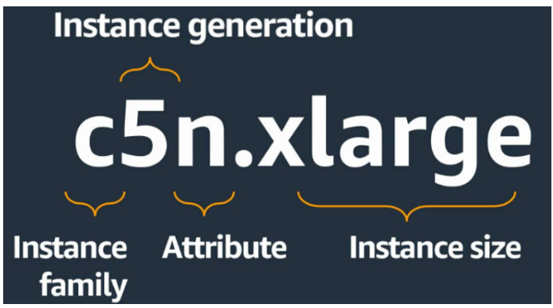
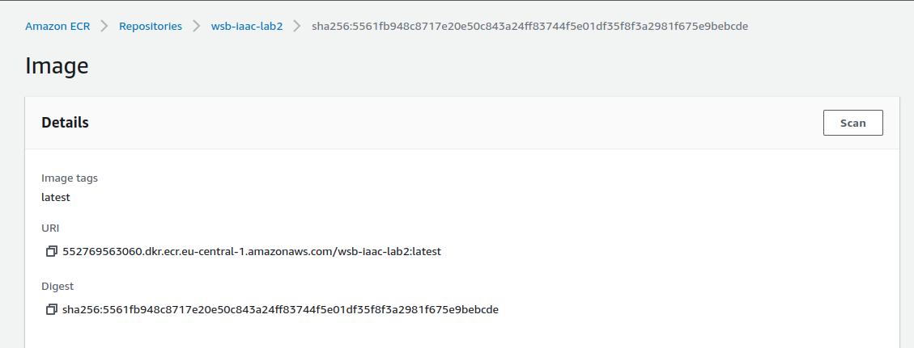
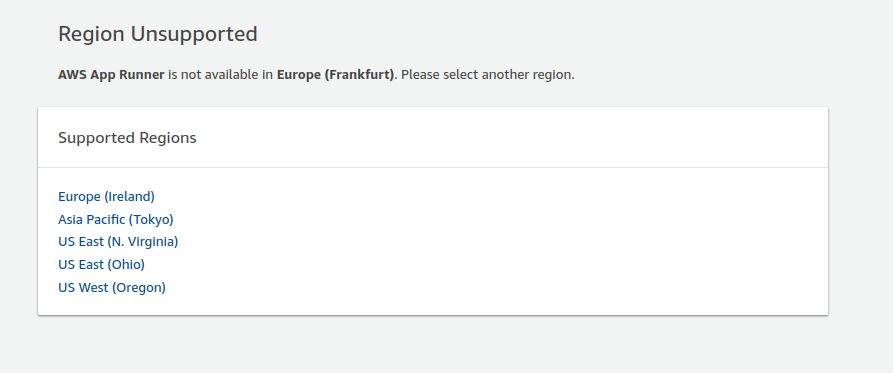
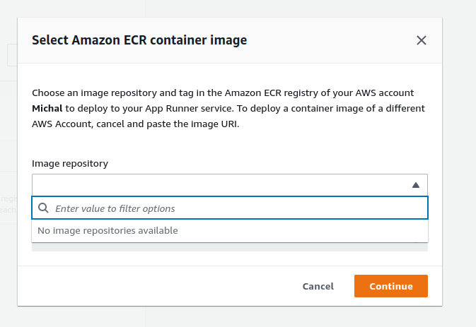
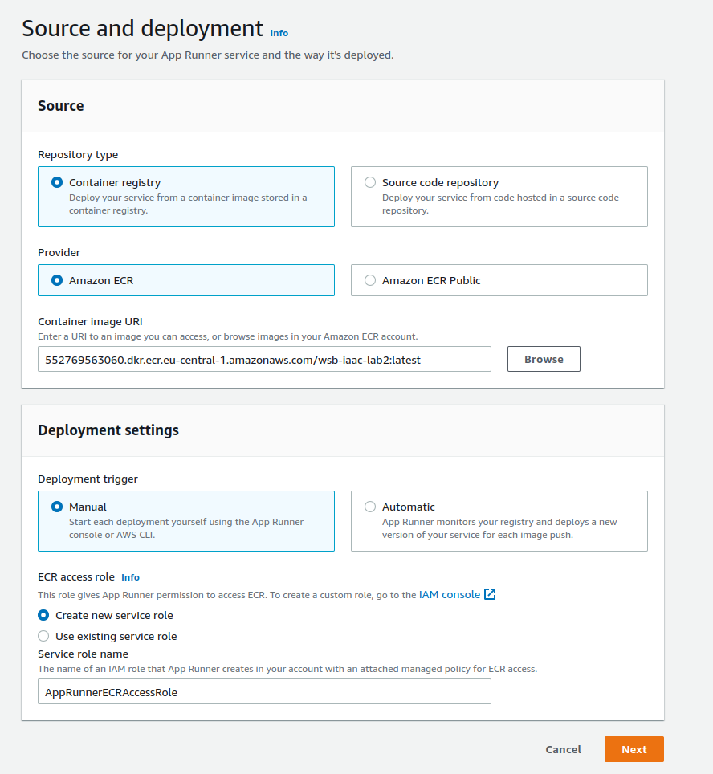
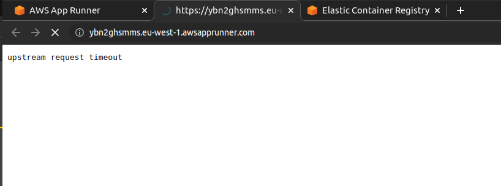
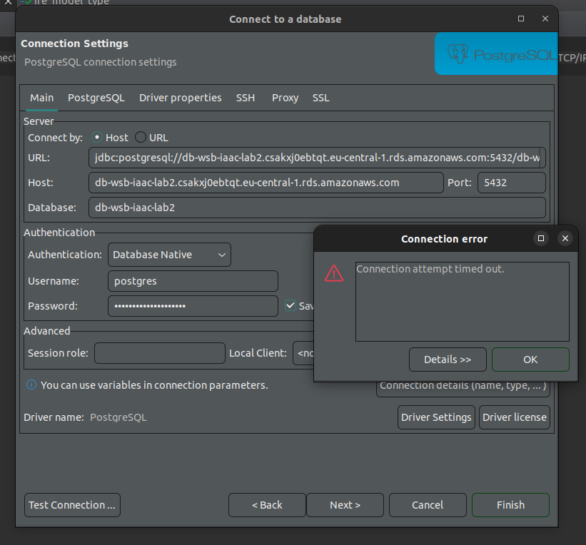
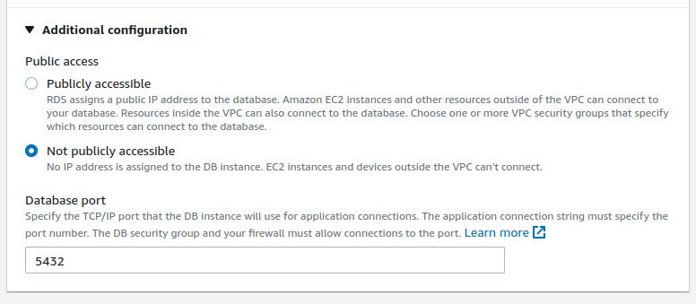
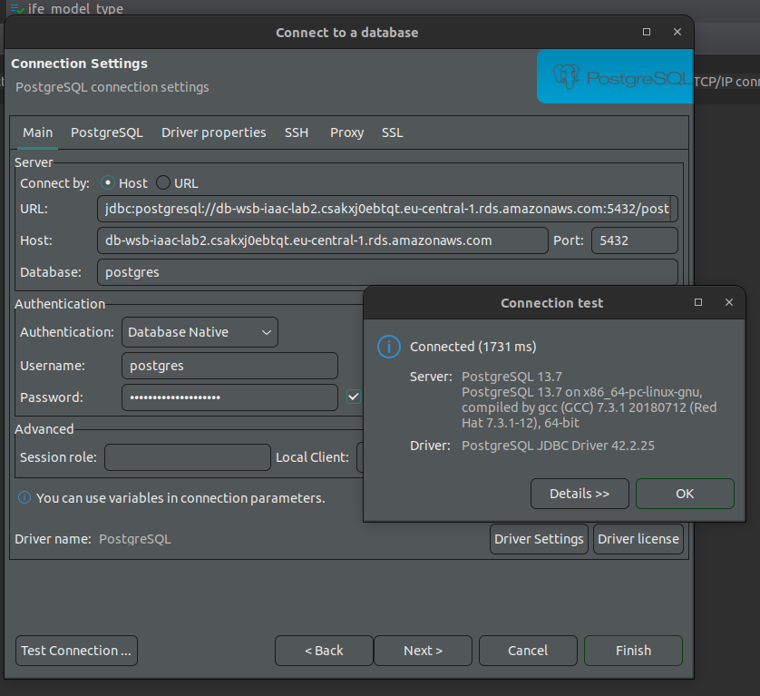
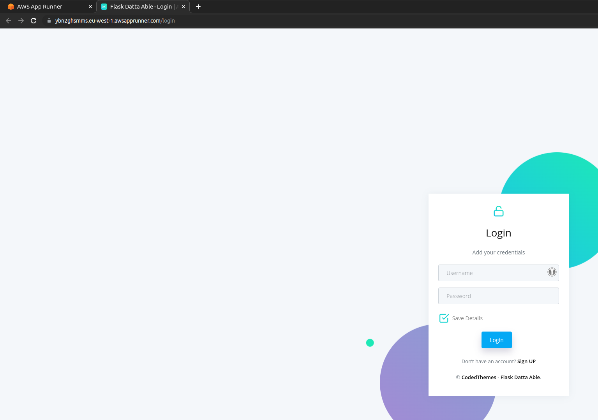

### Zadanie 1 - Docker

```
> docker image ls
REPOSITORY               TAG       IMAGE ID       CREATED        SIZE
kalilinux/kali-rolling   latest    795c029b6f7f   10 days ago    118MB
nginx                    latest    76c69feac34e   6 weeks ago    142MB
node                     16        946ee375d0e0   2 months ago   910MB
ubuntu                   latest    216c552ea5ba   2 months ago   77.8MB

> docker build . -t 76179
(...)
Successfully built 5ee4438835bf
Successfully tagged 76179:latest

> docker image ls
REPOSITORY               TAG             IMAGE ID       CREATED          SIZE
76179                    latest          5ee4438835bf   13 seconds ago   482MB
kalilinux/kali-rolling   latest          795c029b6f7f   10 days ago      118MB
python                   3.9.15-alpine   4ee0f5f41128   10 days ago      48.8MB
nginx                    latest          76c69feac34e   6 weeks ago      142MB
node                     16              946ee375d0e0   2 months ago     910MB
ubuntu                   latest          216c552ea5ba   2 months ago     77.8MB
```

```
> docker run --rm 76179
[2022-12-10 07:21:13 +0000] [9] [INFO] Starting gunicorn 20.1.0
[2022-12-10 07:21:13 +0000] [9] [INFO] Listening at: http://0.0.0.0:8000 (9)
[2022-12-10 07:21:13 +0000] [9] [INFO] Using worker: sync
[2022-12-10 07:21:13 +0000] [12] [INFO] Booting worker with pid: 12
```

Z racji tego, że nie mamy wystawionych portów:
```
> curl localhost:8000
curl: (7) Failed to connect to localhost port 8000 after 0 ms: Connection refused
```

Ale...

```
> docker ps
CONTAINER ID   IMAGE     COMMAND                  CREATED              STATUS              PORTS     NAMES
1ceeff6c4a83   76179     "poetry run task prod"   About a minute ago   Up About a minute             sharp_bhaskara

> docker inspect 1ceeff | grep -i ipaddr
            "SecondaryIPAddresses": null,
            "IPAddress": "172.17.0.2",
                    "IPAddress": "172.17.0.2",

> curl 172.17.0.2:8000
<html>
  <head>
    <title>Internal Server Error</title>
  </head>
  <body>
    <h1><p>Internal Server Error</p></h1>
    
  </body>
</html>
```

Po czym aplikacja ładnie się wykrzacza, bo nie ma połączenia z bazą.

#### Wystawienie portów + kontener z postgresem

```
> docker pull postgress
Status: Downloaded newer image for postgres:latest
docker.io/library/postgres:latest

> docker run --rm --env-file env.docker postgres
...
2022-12-10 07:30:35.100 UTC [1] LOG:  database system is ready to accept connections
```

```
> docker run --rm -p 8000:8000 76179
...
```

#### Dodanie do wspólnej sieci

```
> docker network create lab2zad1

> docker ps
CONTAINER ID   IMAGE      COMMAND                  CREATED         STATUS         PORTS      NAMES
d21bf192d3f7   postgres   "docker-entrypoint.s…"   7 minutes ago   Up 7 minutes   5432/tcp   dazzling_einstein
a06a914a2cbf   76179      "poetry run task pro…"   9 minutes ago   Up 9 minutes              naughty_pare

> docker network connect lab2zad1 d21bf192d3f7
> docker network connect lab2zad1 a06a914a2cbf

> docker network inspect lab2zad1
[
    {
        "Name": "lab2zad1",
        "Id": "331d8ad3f979b2725a5684b4dbb79a22656b14087b443e40c6fda1bb31e8a3bd",
        "Created": "2022-12-10T08:37:40.754018717+01:00",
        "Scope": "local",
        "Driver": "bridge",
        "EnableIPv6": false,
        "IPAM": {
            "Driver": "default",
            "Options": {},
            "Config": [
                {
                    "Subnet": "172.18.0.0/16",
                    "Gateway": "172.18.0.1"
                }
            ]
        },
        "Internal": false,
        "Attachable": false,
        "Ingress": false,
        "ConfigFrom": {
            "Network": ""
        },
        "ConfigOnly": false,
        "Containers": {
            "a06a914a2cbfb2c3708a6b9a3cffb9cbb57b1d3eb411a2a4cacb2f98ca992f5b": {
                "Name": "naughty_pare",
                "EndpointID": "ee096ba4ff1390ca15c683d1c60cfd67afdea9691c9103f778661da4153136ae",
                "MacAddress": "02:42:ac:12:00:03",
                "IPv4Address": "172.18.0.3/16",
                "IPv6Address": ""
            },
            "d21bf192d3f723304519c07202e39ea4c42bd4b609fe5cb4f04d3844102b10da": {
                "Name": "dazzling_einstein",
                "EndpointID": "6bab5746812ae1ac9ebfe9f4beaf2e5f6a9bd337c457f200f7f95295f5ed9d29",
                "MacAddress": "02:42:ac:12:00:02",
                "IPv4Address": "172.18.0.2/16",
                "IPv6Address": ""
            }
        },
        "Options": {},
        "Labels": {}
    }
]
```

#### Zweryfikuj działanie aplikacji

```
Is the server running on that host and accepting TCP/IP connections?
connection to server at "localhost" (::1), port 3306 failed: Address not available
        Is the server running on that host and accepting TCP/IP connections?
```

Co sugeruje, że apka próbuje dobić się do MySQLa, a nie do postgresa - jakby nie było envów ustawionych.

```
> docker exec a06a914a2cbf env
PATH=/usr/local/bin:/usr/local/sbin:/usr/local/bin:/usr/sbin:/usr/bin:/sbin:/bin:/root/.local/bin
HOSTNAME=a06a914a2cbf
LANG=C.UTF-8
GPG_KEY=E3FF2839C048B25C084DEBE9B26995E310250568
PYTHON_VERSION=3.9.15
PYTHON_PIP_VERSION=22.0.4
PYTHON_SETUPTOOLS_VERSION=58.1.0
PYTHON_GET_PIP_URL=https://github.com/pypa/get-pip/raw/66030fa03382b4914d4c4d0896961a0bdeeeb274/public/get-pip.py
PYTHON_GET_PIP_SHA256=1e501cf004eac1b7eb1f97266d28f995ae835d30250bec7f8850562703067dc6
HOME=/root
```

No to spróbujmy odpalić jeszcze raz kontener z odpowiednimi zmiennymi środowiskowymi.

```
conn = _connect(dsn, connection_factory=connection_factory, **kwasync)
sqlalchemy.exc.OperationalError: (psycopg2.OperationalError) could not translate host name "db" to address: Try again
```

Logiczne, nie potrafi rozwiązać `db`. Tworzymy jeszcze raz kontener z bazą, tym razem nadając mu name.
```
> docker run --name db --env-file env.docker postgres
```

Pamiętamy o podpięciu nowo utworzonych kontenerów do sieci.

```
> docker network connect lab2zad1 f5d59320cad5
> docker network connect lab2zad1 16e3062c0517
```

```
> curl localhost:8000
<!DOCTYPE HTML PUBLIC "-//W3C//DTD HTML 3.2 Final//EN"><title>Redirecting...</title> <h1>Redirecting...</h1> <p>You should be redirected automatically to target URL: <a href="/login">/login</a>. If not click the link.> 
```

Looks good. ;)

#### Usunięcie kontenerów

Konter z aplikacją został uruchomiony z flagą `--rm`, więc nie trzeba go dodatkowo usuwać.
```
--rm                             Automatically remove the container when it exits
```

Kontener z bazą usuwamy przy pomocy:

```
> docker container stop db
> docker container rm db
```

#### Pytania

> Czym jest obraz kontenera?

Obraz jest obiektem, który zawiera wszystko, co jest potrzebne do uruchomienia aplikacji, w tym kod, biblioteki i pliki konfiguracyjne.  

> Jak działają warstwy obrazu kontenera?

Cebula ma warstwy, ogry mają warstwy i docker też ma warstwy. ;)

Obraz kontenera jest budowany z warstw. Każda warstwa prezentuje kolejny etap budowania i zmiany względem poprzedniej warstwy.   
Warstwy są hashowana, co pozwala dockerowi na przechowywanie tylko jednej kopii danej warstwy, nawet jeśli jest ona używana przez wiele różnych obrazów.  
Kiedy konrenet jest uruchamiany, jego obraz jest scalany łącząc wszystkie warstwy. Zmiany, które zostaną wprowadzone zostaną zapisane w nowej warstwie, dzięki temu kiedy kontener jest zamykany, można zapisać go jako nowy obraz, który zawiera wszystkie zmiany.

> Czym różni sie kontener od obrazu?

Kontener to instancja uruchomionej aplikacji, która działa na podstawie obrazu. Korzystając z jednego obrazu można uruchomić wiele kontenerów.

> Dlaczego musieliśmy dodatkowo dodać siec, by komunikować dwa kontenery ze soba, skoro działają one na jednym systemie operacyjnym?

Po wytworzeniu kontenerów znajdują sie one w wyizolowanych sieciach tym samym nie mając dostępu do innych kontenerów.

> Wymień elementy konfigurujące środowisko uruchomieniowe (runtime environment) w pliku Dockerfile

**FROM** - obraz na podstawie, którego budowany jest nowy obraz,  
**RUN** - uruchamia polecenie w kontenerze podczas budowy obrazu,  
**ENV** - ustawia zmienne środowiskowe,  
**COPY** - kopiuje pliki z hosta do kontenera,  
**WORKDIR** - ustawia katalog roboczy w kontenerze,  
**ENTRYPOINT** - polecenie, które ma być uruchomione, kiedy kontener jest startowany


### Zadanie 2 - Docker-compose

```
> docker-compose up
...

> docker ps
CONTAINER ID   IMAGE             COMMAND                  CREATED              STATUS              PORTS                                       NAMES
7d690e265321   example-app_app   "poetry run task prod"   About a minute ago   Up About a minute   0.0.0.0:8000->8000/tcp, :::8000->8000/tcp   example-app_app_1
49696c62047b   postgres          "docker-entrypoint.s…"   About a minute ago   Up About a minute   0.0.0.0:5432->5432/tcp, :::5432->5432/tcp   example-app_db_1
```

#### Dodanie sieci

Definiujemy sieć
```
networks:
  lab2zad2:
    driver: bridge
```

po czym dodajemy do niej serwisy.
```
...
networks:
    - lab2zad2
```

Weryfikujemy

```
> docker network inspect example-app_lab2zad2
[
    {
        "Name": "example-app_lab2zad2",
        "Id": "b51fc1aaa800d19119b17178728daed8ebf0cdc03a69b98360295c90881236b1",
        "Created": "2022-12-10T09:25:23.994633942+01:00",
        "Scope": "local",
        "Driver": "bridge",
        "EnableIPv6": false,
        "IPAM": {
            "Driver": "default",
            "Options": null,
            "Config": [
                {
                    "Subnet": "172.20.0.0/16",
                    "Gateway": "172.20.0.1"
                }
            ]
        },
        "Internal": false,
        "Attachable": true,
        "Ingress": false,
        "ConfigFrom": {
            "Network": ""
        },
        "ConfigOnly": false,
        "Containers": {
            "1b12cac91fb83cd095dfff0a59849e988404538232668dcd25fdb8c52776b04e": {
                "Name": "example-app_app_1",
                "EndpointID": "5e1ef5c59a91d902cbba5b3fea93d6e20f29d56a6c40bc08eae742f7c90765e0",
                "MacAddress": "02:42:ac:14:00:03",
                "IPv4Address": "172.20.0.3/16",
                "IPv6Address": ""
            },
            "e2cb88e7ab63e8e5de88d6baacbaab516c8182b85e3b740cb12482cc4041986c": {
                "Name": "example-app_db_1",
                "EndpointID": "1721212d9460734a83c962b219c37369673211dc619398272e528072e9465c86",
                "MacAddress": "02:42:ac:14:00:02",
                "IPv4Address": "172.20.0.2/16",
                "IPv6Address": ""
            }
        },
        "Options": {},
        "Labels": {
            "com.docker.compose.network": "lab2zad2",
            "com.docker.compose.project": "example-app",
            "com.docker.compose.version": "1.29.2"
        }
    }
]
```

#### Pytania

> Czym jest docker-compose w stosunku do poleceń Dockera z poprzedniego zadania?

Docker-compose pozwala w prosty sposób zarządzać aplikacjami składającymi się z wielu kontenerów.  
Dzięki niemu można skonfigurować wiele kontenerów w jednym pliku i uruchomić je jednym poleceniem. 

> Jak nazywane są kontenery działające w ramach stosu?

Kontenery działające w ramach stosu nazywane są serwisami.

> Czym jest stos aplikacji?

Stos aplikacji to grupa różnych aplikacji i usług, które działają razem.

### Zadanie 3 - wykorzystanie EC2 jako maszyny do uruchamiania aplikacji


```
> chmod 400 ~/Desktop/wsb-iaac/wsb-iaac.pem 

> ssh -i wsb-iaac.pem ec2-user@ec2-52-91-239-211.compute-1.amazonaws.com

       __|  __|_  )
       _|  (     /   Amazon Linux 2 AMI
      ___|\___|___|

https://aws.amazon.com/amazon-linux-2/
19 package(s) needed for security, out of 31 available
Run "sudo yum update" to apply all updates.
[ec2-user@ip-172-31-94-193 ~]$ 
```

#### Pytania

> Rozwiń skrót EC2

Amazon EC2 - Amazon Elastic Compute Cloud

> Jakiego typu wirtualizacji użyłeś do stworzenia instancji? Czy są inne możliwe typy do wykorzystania?

Do stworzenia instancji została wykorzystana sprzętowa maszyna wirtualna (HVM).  
Do wyboru jest jeszcze drugi rodzaj wirtualizacji - parawirtualizacja (PV).  
Główne różnice między PV i HVM to sposób korzystania ze specjalnych rozszerzeń sprzętowych w celu uzyskania lepszej wydajności.


> Jakie narzędzie do system zarządzania pakietami dla systemów linuksowych używa stworzona przez ciebie maszyna

Stworzona maszyna korzysta z systemu Yum (Yellowdog Updater Modified), który jest standardowym system zarządzania pakietami dla dystrybucji Fedora i RHEL.


### Zadanie 4 - CloudFormation tworzenie pierwszego stosu

#### Instalacja aws-cli lokalnie

```
> curl "https://awscli.amazonaws.com/awscli-exe-linux-x86_64.zip" -o "awscliv2.zip"
...

> unzip awscliv2.zip
...

> sudo ./aws/install 
You can now run: /usr/local/bin/aws --version

> which aws
/usr/local/bin/aws

> aws --version
aws-cli/2.9.15 Python/3.9.11 Linux/5.19.0-29-generic exe/x86_64.ubuntu.22 prompt/off
```

Przechodzimy do **Acc -> Security credentials** i tworzymy nowy **Access key**

```
> aws configure
AWS Access Key ID [None]: scoobydoo
AWS Secret Access Key [None]: ueuo-ueuo-call-the-scooby-doo
Default region name [None]: eu-central-1
Default output format [None]: json
```

Korzystając z okazji ustawiamy domyślny region na **Frankfurt**, a domyślny format danych wyjściowych na **json**.

#### Deploy

```
> aws cloudformation create-stack --template-body file://ec2.yaml --stack-name first-stack --parameters ParameterKey=KeyName,ParameterValue=wsb-iaac ParameterKey=InstanceType,ParameterValue=t2.micro
{
    "StackId": "arn:aws:cloudformation:eu-central-1:552769563060:stack/first-stack/c1967740-95bb-11ed-8d46-06fa09298b30"
}
```

No i coś nie ma naszych outputów, więc zaczynamy podejrzewać, żę "something is no yes".

```
> aws cloudformation list-stacks
{
    "StackSummaries": [
        {
            "StackId": "arn:aws:cloudformation:eu-central-1:552769563060:stack/first-stack/c1967740-95bb-11ed-8d46-06fa09298b30",
            "StackName": "first-stack",
            "TemplateDescription": "AWS CloudFormation Sample Template EC2InstanceWithSecurityGroupSample: Create an Amazon EC2 instance running the Amazon Linux AMI. The AMI is chosen based on the region in which the stack is run. This example creates an EC2 security group for the instance to give you SSH access. **WARNING** This template creates an Amazon EC2 instance. You will be billed for the AWS resources used if you create a stack from this template.",
            "CreationTime": "2022-12-16T16:35:38.300000+00:00",
            "DeletionTime": "2022-12-16T16:35:40.506000+00:00",
            "StackStatus": "ROLLBACK_COMPLETE",
            "DriftInformation": {
                "StackDriftStatus": "NOT_CHECKED"
            }
        }
    ]
}
```

`ROLLBACK_COMPLETE` wygląda mało zachęcająco.
```
ROLLBACK_COMPLETE - Successful removal of one or more stacks after a failed stack creation or after an explicitly canceled stack creation. The stack returns to the previous working state. Any resources that were created during the create stack operation are deleted.

This status exists only after a failed stack creation. It signifies that all operations from the partially created stack have been appropriately cleaned up. When in this state, only a delete operation can be performed.
```

```
> aws cloudformation describe-stack-events --stack-name first-stack
{
    "StackEvents": [
        {
            "StackId": "arn:aws:cloudformation:eu-central-1:552769563060:stack/first-stack/c1967740-95bb-11ed-8d46-06fa09298b30",
            "EventId": "db0bccc0-95bb-11ed-ae55-0aa2d400e970",
            "StackName": "first-stack",
            "LogicalResourceId": "first-stack",
            "PhysicalResourceId": "arn:aws:cloudformation:eu-central-1:552769563060:stack/first-stack/c1967740-95bb-11ed-8d46-06fa09298b30",
            "ResourceType": "AWS::CloudFormation::Stack",
            "Timestamp": "2022-12-16T16:35:58.470000+00:00",
            "ResourceStatus": "ROLLBACK_COMPLETE"
        },
        {
            "StackId": "arn:aws:cloudformation:eu-central-1:552769563060:stack/first-stack/c1967740-95bb-11ed-8d46-06fa09298b30",
            "EventId": "d0572b30-95bb-11ed-980a-06e098604f8a",
            "StackName": "first-stack",
            "LogicalResourceId": "first-stack",
            "PhysicalResourceId": "arn:aws:cloudformation:eu-central-1:552769563060:stack/first-stack/c1967740-95bb-11ed-8d46-06fa09298b30",
            "ResourceType": "AWS::CloudFormation::Stack",
            "Timestamp": "2022-12-16T16:35:40.506000+00:00",
            "ResourceStatus": "ROLLBACK_IN_PROGRESS",
            "ResourceStatusReason": "Parameter validation failed: parameter value wsb-iaac for parameter name KeyName does not exist. Rollback requested by user."
        },
        {
            "StackId": "arn:aws:cloudformation:eu-central-1:552769563060:stack/first-stack/c1967740-95bb-11ed-8d46-06fa09298b30",
            "EventId": "cefb92d0-95bb-11ed-9f19-062932a2f970",
            "StackName": "first-stack",
            "LogicalResourceId": "first-stack",
            "PhysicalResourceId": "arn:aws:cloudformation:eu-central-1:552769563060:stack/first-stack/c1967740-95bb-11ed-8d46-06fa09298b30",
            "ResourceType": "AWS::CloudFormation::Stack",
            "Timestamp": "2022-12-16T16:35:38.300000+00:00",
            "ResourceStatus": "CREATE_IN_PROGRESS",
            "ResourceStatusReason": "User Initiated"
        }
    ]
}
```

`Parameter validation failed: parameter value wsb-iaac for parameter name KeyName does not exist. Rollback requested by user.`

Chwila na pomyślunek... wsb-iaac było tworzone w regionie **us-east-1**, natomiast przy instalacji CLI zdefiniowaliśmy domyślny region na **us-central-1**.  
Tworzymy nową parę kluczy i próbujemy jeszcze raz.  
Wcześniej usuwamy stary stack.

```
> aws cloudformation list-stack-resources --stack-name first-stack
{
    "StackResourceSummaries": [
        {
            "LogicalResourceId": "EC2Instance",
            "PhysicalResourceId": "i-0542f39baa6ece307",
            "ResourceType": "AWS::EC2::Instance",
            "LastUpdatedTimestamp": "2022-12-16T17:18:40.111000+00:00",
            "ResourceStatus": "CREATE_COMPLETE",
            "DriftInformation": {
                "StackResourceDriftStatus": "NOT_CHECKED"
            }
        },
        {
            "LogicalResourceId": "InstanceSecurityGroup",
            "PhysicalResourceId": "first-stack-InstanceSecurityGroup-1CV882EG9798D",
            "ResourceType": "AWS::EC2::SecurityGroup",
            "LastUpdatedTimestamp": "2022-12-16T17:18:05.606000+00:00",
            "ResourceStatus": "CREATE_COMPLETE",
            "DriftInformation": {
                "StackResourceDriftStatus": "NOT_CHECKED"
            }
        }
    ]
}
```

```
> aws ec2 describe-instances --instance-ids i-0542f39baa6ece307 | grep -i publicip
                    "PublicIpAddress": "18.197.108.212",
                                "PublicIp": "18.197.108.212"
                                        "PublicIp": "18.197.108.212"
```

```
> ssh -i ~/Desktop/eu-wsb/eu-wsb-iaac.pem ec2-user@18.197.108.212

       __|  __|_  )
       _|  (     /   Amazon Linux AMI
      ___|\___|___|

https://aws.amazon.com/amazon-linux-ami/2018.03-release-notes/
33 package(s) needed for security, out of 50 available
Run "sudo yum update" to apply all updates.
[ec2-user@ip-172-31-29-130 ~]$ 
```

Udało się zalogować. Usuwamy stos.
```
> aws cloudformation delete-stack --stack-name first-stack
```

#### Pytania

> Wewnątrz szablonu CloudFormation ec2.yaml znajduje się długa matryca AWSInstanceType2Arch wymień je ze względu na typ 



Previous generation instances:
 T1, M1, M2, M3, C1, C3, G2, R3, I2

General purpose:
 T2, M4

Compute optimized
 C4, CC2

Memory optimized:
 CR1

Storage optimized:
 D2, HS1

> Sekcja Resources zdefiniowała tworzone zasoby wymień je

* instancja EC2
* security group

> Czym jest AZ w sekcji Outputs oraz w jakim AvailabilityZone jest stworzony stos?

AZ w tym wypadku jest logicznym identyfikatorem, podobnie jak InstanceId, PublicDNS i PublicIP. Identyfikator musi być unikalny w obrębie szablonu.  
W tym wypadku AZ to eu-central-1a.


> Czy usuwając stos o nazwie zadanej usunęliśmy wszystkie zasoby?

Tak, usuwając stos zostały usunięte również wszystkie zasoby.

### Zadanie 5 - ECR - Elastic Container Registry, RDS - Relational Database Service i AppRunner

#### ECR

```
> aws ecr get-login-password --region eu-central-1 | docker login --username AWS --password-stdin 552769563060.dkr.ecr.eu-central-1.amazonaws.com
...
Login Succeeded

> pwd
(...)/iac-labs/example-app

> docker build -t wsb-iaac-lab2 .
...
 ---> 4ba6120e643e
Successfully built 4ba6120e643e
Successfully tagged wsb-iaac-lab2:latest

> docker tag wsb-iaac-lab2:latest 552769563060.dkr.ecr.eu-central-1.amazonaws.com/wsb-iaac-lab2:latest

> docker push 552769563060.dkr.ecr.eu-central-1.amazonaws.com/wsb-iaac-lab2:latest
```



#### RDS


#### AppRunner!



Wybieramy inny region.


Jak możesz App runnerze... i Ty przeciwko mnie?


a może jednak...


wygląda ok, no to wchodzimy pod adres żeby zweryfikować i...



zaglądamy w logi

```
01-16-2023 11:21:39 PM The above exception was the direct cause of the following exception:
01-16-2023 11:21:39 PM 	Is the server running on that host and accepting TCP/IP connections?
01-16-2023 11:21:39 PM psycopg2.OperationalError: connection to server at "db-wsb-iaac-lab2.csakxj0ebtqt.eu-central-1.rds.amazonaws.com" (172.31.29.59), port 5432 failed: Operation timed out
```

Próbujemy połączyć się przy pomocy dbeavera.


Zaglądamy w connectivity i zmieniamy rodzaj dostępu.  
Można również pokusić się nad jednym vpc.



Wchodzimy w ustawienia Security group -> Inbound rules.
Dodajemy rulkę żeby postgres był dostępny z każdego adresu.


Próbujemy jeszcze raz połączyć się przy pomocy dbeavera.  
Przy okazji zauważamy, że mieliśmy złą nazwę db.



Edytujemy konfigurację serwisu w App runnerze (zmieniając nazwę bazy), gdy już leniuszek wstanie to próbujemy jeszcze raz.

```
> curl https://ybn2ghsmms.eu-west-1.awsapprunner.com
<!DOCTYPE HTML PUBLIC "-//W3C//DTD HTML 3.2 Final//EN"><title>Redirecting...</title> <h1>Redirecting...</h1> <p>You should be redirected automatically to target URL: <a href="/login">/login</a>. If not click the link.
```



Yay, wygląda dobrze. :)  
Usuwamy wszystkie zasoby.